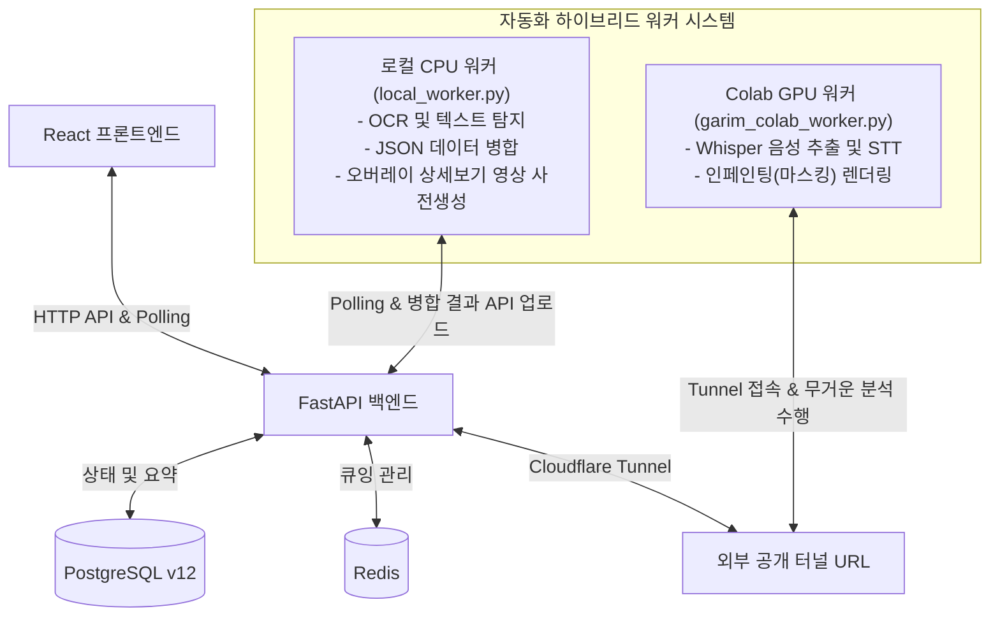
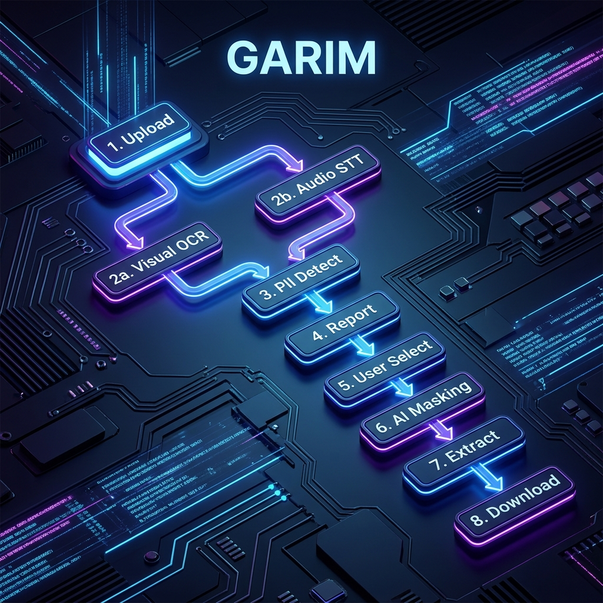
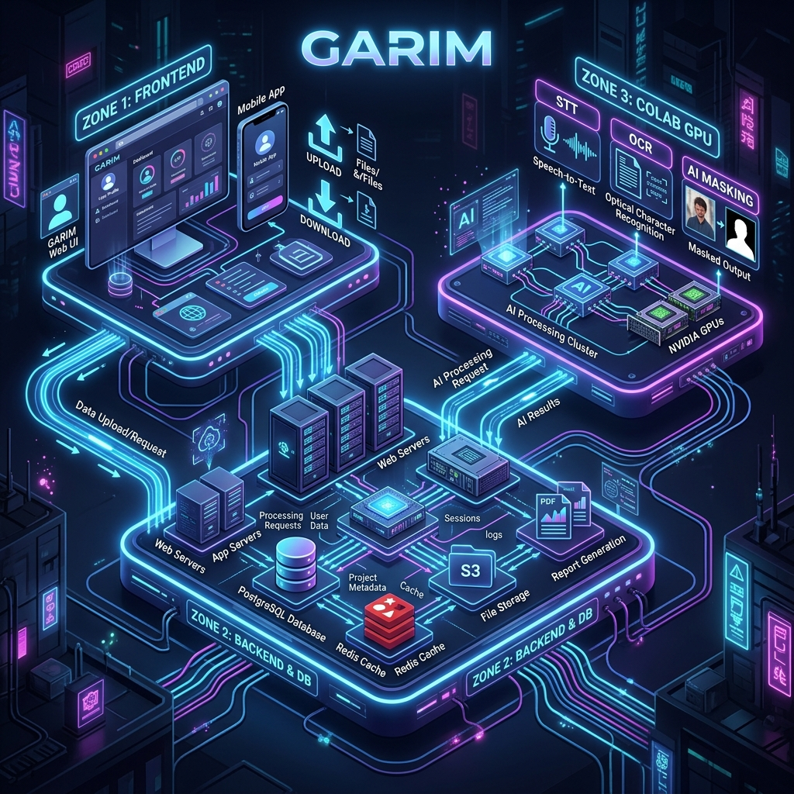

# 🎥 GARIM (가림) - 딥러닝 기반의 개인정보 도싱 방지 플랫폼

본 프로젝트는 이미지/영상/음성 내의 **개인 식별 정보(PII)**를 자동으로 탐지하고 완벽하게 마스킹(Inpainting) 및 묵음 처리(Beeping)하여, **'퍼즐 도싱(Doxxing)'**과 같은 개인정보 유출을 방지하기 위한 AI 서비스입니다.

---

<div style="display: flex; align-items: center; gap: 8px;">
  <div>
    
    
    
    
    
    
    
    
    
    
    
  </div>
</div>
---

## 시연 영상
https://github.com/user-attachments/assets/9fdc3233-0e97-42b6-979c-363f096d64ae

---
## 💡 개발 배경 및 목적

소셜 미디어와 영상 콘텐츠의 급증으로 누구나 쉽게 영상을 공유할 수 있게 되었지만, 영상 내에 포함된 주소, 얼굴, 전화번호 등의 개인정보 유출 위험성은 날로 커지고 있습니다. 특히 파편화된 정보를 모아 개인을 특정하는 **퍼즐 도싱(Doxxing)** 범죄를 예방하기 위해, 영상의 시각 정보뿐만 아니라 **음성(STT) 정보**까지 완벽하게 스크리닝하고 마스킹하는 완전 자동화 솔루션을 개발하게 되었습니다.

## ⚙️ 서비스 핵심 기능

1. **시각적 개인정보 탐지 및 마스킹 (Inpainting)**
   - 영상 내의 얼굴, 텍스트(주소, 전화번호 등)를 객체 추적 및 OCR 기술로 탐지합니다.
   - 단순 모자이크를 넘어 주변 배경으로 자연스럽게 채워 넣는 인페인팅 기술을 적용합니다.
2. **음성 개인정보 탐지 및 묵음 처리 (STT & Beeping)**
   - Whisper AI 모델을 활용해 음성을 텍스트로 변환하고, PII를 추출합니다.
   - 특정 개인정보 구간의 오디오 파형만 정확히 분리하여 묵음(Beep) 처리합니다.
3. **분산 하이브리드 파이프라인 (Local CPU + Colab GPU)**
   - 무거운 GPU 작업(Whisper STT, 인페인팅)은 외부 Colab 환경으로 오프로드(Offload)합니다.
   - 가벼운 CPU 작업(OCR, 영상 병합, 렌더링)은 로컬 워커에서 병렬 처리하여 병목을 극복합니다.
4. **UX 최적화**
   - 사용자가 "상세보기" 버튼을 누르기 전에 결과를 미리 생성하여 지연 시간을 없앴습니다.
   - 전체 인코딩 대신 PII 발생 전후 3초(총 6초)만 샘플링하여 실시간 미리보기를 제공합니다.

---

## 🏛 시스템 아키텍처 및 데이터 흐름

아래 그래프를 보려면, <br/>Markdown Preview Mermaid Support 확장 프로그램이 필요합니다.<br/>(https://open-vsx.org/vscode/item?itemName=bierner.markdown-mermaid)



- **메타데이터 분리 전략**: 렌더링에 필요한 가벼운 정보(타임라인, 바운딩 박스)는 `PostgreSQL` DB에 저장하고, 무거운 다각형 좌표 등은 `result.json`으로 스토리지에 분리 저장하여 성능을 극대화했습니다.

---

 - 확장팩 없어서 그래프 안보이는 분들은 아래 시각화로 확인해주세요

**흐름도 시각화**
---


**아키텍처 시각화**
---


---
## 📂 프로젝트 폴더 구조

```text
Human_Final_PJ-main/
├── frontend/               # React 프론트엔드 (Vite, TailwindCSS)
│   ├── dist/               # Vite 빌드 도구 압축결과물 (배포용 파일)
│   ├── public/             # 정적 파일 (파비콘 등) 보관 폴더
│   ├── scripts/            # 프론트엔드 자동화 및 유틸리티 스크립트
│   ├── src/                # 실제 React 소스 코드
│   │   ├── assets/         # 폰트, 로고 등 정적 리소스
│   │   ├── components/     # 재사용 가능한 UI 컴포넌트
│   │   ├── context/        # 전역 상태 관리
│   │   ├── css/            # 스타일시트 분리 관리 (사용자 규칙)
│   │   ├── data/           # 로컬 정적 데이터
│   │   ├── hooks/          # 커스텀 리액트 훅
│   │   ├── pages/          # 화면(페이지) 단위 컴포넌트
│   │   ├── utils/          # 헬퍼 함수 및 공통 로직
│   │   ├── App.jsx         # 최상위 라우터 컴포넌트
│   │   └── main.jsx        # 앱 렌더링 진입점
│   ├── index.html          # 메인 HTML 템플릿
│   ├── package.json        # 의존성 패키지 및 스크립트 설정
│   └── vite.config.js      # Vite 빌드 도구 설정 파일
├── backend/                # FastAPI 백엔드
│   ├── controllers/        # 요청/응답 처리 및 Service 호출
│   ├── core/               # DB 설정, 보안, 환경변수 등 공통 설정
│   ├── docker/             # DB 초기화 SQL 및 로컬 데이터 저장소 (Volume)
│   ├── local_worker/       # 로컬 CPU 백그라운드 비동기 워커
│   ├── models/             # DB 테이블 매핑 (SQLAlchemy 등 ORM)
│   ├── routes/             # API 엔드포인트 라우팅 (URL 매핑)
│   ├── schemas/            # 데이터 검증 및 직렬화 (Pydantic DTO)
│   ├── services/           # 핵심 비즈니스 로직 (AI 처리, 결제 로직 등)
│   ├── storage/            # 영상/이미지 업로드 및 처리 결과 저장소 (temp/uploads)
│   ├── tools/              # 외부 도구
│   ├── utils/              # 재사용 가능한 유틸리티 함수
│   ├── cloudflare_tunnel.py # 클라우드플레어 터널 연결 스크립트(코랩 전용/일회성 URL 생성 시 사용)
│   ├── Dockerfile          # 백엔드용 도커 이미지 빌드 파일
│   ├── main.py             # 서버 실행 및 앱 진입점
│   └── requirements.txt    # 파이썬 의존성 패키지 목록
├── colab/                  # Colab 전용 GPU 워커 스크립트 (STT, Inpainting 마스킹)
├── nginx/                  # Nginx 리버스 프록시 설정 (dev.conf, prod.conf)
├── docs/                   # 프로젝트 문서 (아키텍처, 기획, API 명세, DB 설계도 등)
└── docker-compose.yml      # 통합 서버 구동을 위한 도커 컴포즈 파일
```

---

## ☁️ Colab 워커 전용 구조 및 STT 모델 설정 가이드

가림(GARIM) 서비스의 AI 영상/음성 분석은 GPU 연산 성능이 필수적이기도 하고, 작업 속도를 높이기 위해 로컬과 병렬로 **Google Colab(코랩)의 GPU를 비동기 워커(Worker) 서버로 활용**하는 통신 구조를 채택했습니다.

### 📂 코랩(colab) 폴더 내부 파일 구성

- **`garim_colab_worker.py`**: 워커의 메인 컨트롤 타워입니다. 정식 도메인(`garim.shop`) 백엔드와 통신하며 작업(Job)을 가져오고 처리 결과를 다시 백엔드로 전송합니다.
- **`colab_pipeline_stt.py`**: 오디오 추출 및 대용량 STT(Whisper Large) 음성 인식을 전담하는 파이프라인 스크립트입니다.
- **`colab_pipeline_mask.py`**: 영상 내 개인정보(얼굴, 번호판 등)를 감지하고 모자이크/인페인팅 처리를 수행하는 시각 처리 파이프라인입니다.
- **`COLAB_WORKER_RUNBOOK.md`**: 코랩 세팅부터 실행까지의 상세 가이드 문서입니다.

### 🚀 왜 STT 모델을 구글 드라이브에서 직접 로드하나요?

STT 분석에 사용되는 AI 모델은 용량이 **3GB 이상**에 달하는 Large 모델 입니다.
코랩 환경은 세션이 끊기거나 재시작될 때마다 모든 저장 데이터가 초기화됩니다. 만약 분석을 시작할 때마다 코랩 서버가 3GB의 모델을 새로 다운로드받는 방식을 취한다면, **작업을 시작하기 위해 대기하는 시간이 너무 길어지는 치명적인 성능 저하**가 발생합니다.

이를 해결하기 위해, 현재 워커 코드는 **"개인 구글 드라이브에 대용량 모델을 한 번만 영구적으로 저장해두고, 코랩이 드라이브와 직접 마운트(Mount)하여 모델을 꺼내 쓰는 방식"** 으로 매우 효율적으로 설계되어 있습니다.

### 🛠️ 다른 사용자가 코드를 내려받아 테스트할 때의 주의사항

이 깃허브 프로젝트를 클론(Clone)하여 본인의 환경에서 직접 코랩 워커를 구동해 보시려는 분들은, 코드를 실행하기 전 아래의 **구글 드라이브 세팅**을 반드시 진행하셔야 워커가 정상적으로 작동합니다.

1. 본인의 **Google Drive** 최상단(`MyDrive`)에 `final_PJ_model` 이라는 폴더를 생성합니다.
2. 깃허브 저장소의 `colab` 폴더에 있는 파이썬 스크립트 3개(`garim_colab_worker.py`, `colab_pipeline_stt.py`, `colab_pipeline_mask.py`)를 방금 만든 구글 드라이브 폴더 안에 업로드합니다.
3. 동일한 구글 드라이브 폴더 안에 분석 중간 결과물을 저장할 빈 폴더인 `output_file` 폴더를 생성합니다.
4. 마지막으로 3GB 이상의 대용량 **STT 모델 폴더(`STT_Model/`)** 를 직접 업로드하여 최종적으로 구글 드라이브를 아래와 같은 구조로 세팅합니다.
   ```text
   MyDrive/
   └── final_PJ_model/
       ├── STT_Model/
       │   └── Large/                 # STT Large 모델 필수 폴더
       ├── output_file/               # 빈 폴더 (중간 결과물 임시 저장용)
       ├── colab_pipeline_mask.py     # 시각 처리 파이프라인 코드
       ├── colab_pipeline_stt.py      # 음성 처리 파이프라인 코드
       └── garim_colab_worker.py      # 메인 워커 실행 코드
   ```
5. 세팅이 완료된 후 코랩 환경에서 구글 드라이브에 있는 `garim_colab_worker.py` 코드를 붙여넣고 실행하면, 하드코딩된 경로(`/content/drive/MyDrive/final_PJ_model/`)를 통해 파이프라인과 대용량 모델을 자동으로 연결하여 **대기 시간 0초 만에 즉시 AI 분석을 시작**합니다.

_(상세한 코랩 환경 세팅 및 파이프라인 파일 업로드 방법은 `colab/COLAB_WORKER_RUNBOOK.md` 문서를 꼼꼼히 참조해 주세요.)_

---

## 📦 설치 및 통합 환경 실행 (Docker)

모든 백엔드, 프론트엔드, DB 환경은 **Docker Compose**를 통해 한 번에 구동할 수 있습니다.

> ⚠️ **주의사항**: Docker 파일 바인드 마운트 버그 방지를 위해, 프로젝트 폴더는 가상 네트워크 드라이브(Google Drive 등)가 아닌 실제 로컬 디스크(`C:\` 또는 `D:\`)에 위치해야 합니다.

1. **가상환경 설정** (선택사항)

   ```bash
   # Anaconda 설치 확인 및 가상환경 설정
   conda create -n final python=3.10 -y

   # 가상환경 접속
   conda activate final
   ```

2. **통합 서버 실행**

   ```bash
   # 서버 실행
   docker-compose up --build -d

   # (참고)서버 다운
   docker-compose down

   # (참고)서버 로그 확인
   docker logs -f final_backend
   ```

   - 프론트엔드, 백엔드, PostgreSQL, Redis, Nginx, Cloudflare Tunnel이 한 번에 실행됩니다.
   - **서비스 접속**: `http://localhost` (내부망) 또는 `https://garim.shop` (외부망)

3. **Colab GPU 워커 연동 (Cloudflare 정식 터널 사용 시 도커만 실행하면됨)**

   정식 도메인이 없이 임시로 사용 시 [임시터널 사용방법](./colab/COLAB_WORKER_RUNBOOK.md) 해당 문서 참고

---

## 📆 개발 과정

- **개발 기간**: 2026년 5월 11일 ~ 6월 22일
- [참조문서(프로젝트 총정리)](<./docs/(참조)프로젝트_총정리_final.md>)
- [참조문서(프로젝트 흐름도)](<./docs/(참조)프로젝트_흐름분석_final.md>)
- [참조문서(프론트 ↔ 백엔드 api 명세)](<./docs/(참조)프론트_백엔드연결_final.md>)

### 📝 가이드라인

- [코드 작성 규칙 (CODE_DOCS)](./docs/guides/CODE_DOCS.md)
- [Git 커밋 메시지 규칙](./docs/guides/GIT_메세지작성.md)

---

## ©️ License

본 프로젝트의 코드는 비상업적 용도로 자유롭게 사용하실 수 있습니다. 상업적 이용이나 수정, 재배포 시에는 사전 연락을 부탁드립니다.

## 👨‍💻👩‍💻 Collaborator

- [김용민](aokiuru@gmail.com)
- [고관홍](socool.kh2@gmail.com)
- [김민영](miny007708@gmail.com)
- [오세덕](younadme0112@gmail.com)
- [임정은](jlu4688@gmail.com)
- [이은우](zx110500@gmail.com)
- [남태우](namdoil495@gmail.com)
