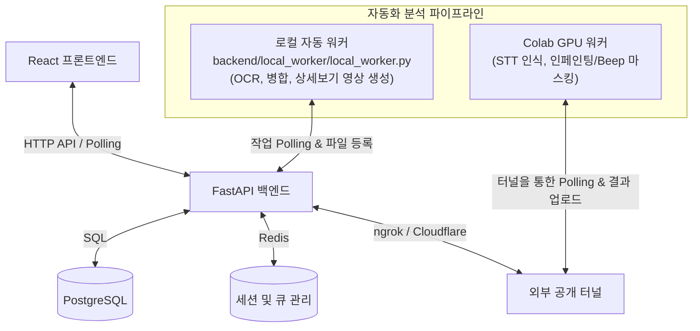

# GARIM 프로젝트 아키텍처 및 데이터 흐름 분석 리포트 (Final)

## 1. 아키텍처 발전 개요 (v1 → v2 → v3 → Final)

초기 단일 스크립트 기반 아키텍처에서 현재의 완전 자동화된 하이브리드 시스템으로 발전하기까지의 흐름은 다음과 같습니다.

- **v1 (초기 단일 아키텍처)**: 하나의 파이썬 스크립트에서 OCR, STT, 마스킹을 모두 순차 처리. 무거운 AI 모델 로드로 인한 메모리 부족 및 타임아웃 발생이 잦았습니다.
- **v2 (분산 파이프라인 도입)**: 로컬 환경(CPU)과 외부 Colab(GPU)을 융합한 5분할 하이브리드 파이프라인 구조를 도입하여 병목 현상을 완화했습니다. `result.json`을 데이터 공유의 핵심으로 설계했습니다.
- **v3 (자동화 기반 마련)**: 각 모듈 간의 연결을 수동으로 하던 한계를 넘어, 백엔드와 연동되는 자동화 워커(`local_worker.py` 등)의 뼈대를 구축했습니다.
- **Final (최종 완전 자동화)**: 프론트엔드의 사용자 요청(업로드)부터 결과 파일 도출까지 사람의 개입 없이 자동으로 흘러가는 E2E(End-to-End) 파이프라인 연동을 완성했습니다. 영상 마스킹 시 미리보기/상세보기 선생성 등의 최적화 기법이 적용되었습니다.

---

## 2. 최종 시스템 아키텍처

---

## 3. 핵심 데이터 저장소 및 파이프라인 산출물 매핑

기존 DB 아키텍처의 병목을 피하기 위해, 가벼운 메타데이터는 RDBMS에 저장하고, 무거운 좌표 데이터(Polygons, Keyframes 등)는 JSON 파일로 분리하여 관리합니다.

| 산출물 | 저장 방식 및 위치 | 데이터 접근 전략 |
|---|---|---|
| **시각/음성 PII 요약 정보** | `detections` 테이블 (DB) | UI 렌더링에 필요한 최소 정보(bbox, 라벨, 시간)만 신속하게 조회 |
| **상세 좌표 (keyframes 등)** | `result.json` 파일 (Storage) | 파일 경로만 `analysis_artifacts`에 보관, 워커 및 오버레이 시 직접 참조 |
| **상세보기 보조 파일** | `_상세보기.mp4`, `_tracks.json` | 병합(Merge) 단계 직후 선(先)생성하여 `analysis_artifacts`에 즉시 등록 |
| **사용자 선택 정보** | `replacement_actions` 테이블 | 마스킹할 대상(`is_user_selected=true`)만 선별하여 워커에 전달 |
| **최종 마스킹 완성본** | `processed_files` 테이블 | 마스킹 완료 후 파일 경로 등록 (요금제에 따른 `expires_at` 만료일 적용) |

---

## 4. 파이프라인 실행 워크플로우 (상세)

로컬 워커(`local_worker.py`)는 매 5초마다 백엔드의 Job Queue를 확인하여 아래 과정을 자동으로 수행합니다.

1. **OCR 탐지 (로컬 CPU)**: `OCR_pipeline_report.py` 구동. 프레임 단위 텍스트 추출 후 `index.json` 생성. 영상의 경우 동시에 Colab STT 작업 완료를 대기.
2. **STT 인식 (Colab GPU)**: `colab_pipeline_stt.py`가 오디오를 추출하여 Whisper로 음성 인식 및 PII 탐지 후 결과 전달.
3. **병합 및 마커 생성**: `backend_json_merger.py`가 시각/음성 데이터를 통합하여 단일 **`result.json`** 생성. UI용 타임라인 마커 데이터 병합.
4. **미리생성 (Pre-rendering)**: 병합이 끝나자마자 `pipeline_detail_view.py`가 호출되어 프론트엔드 오버레이를 위한 `tracks.json`과 `상세보기.mp4`를 생성.
5. **DB 등록 및 완료**: 탐지된 PII 요약 데이터를 백엔드 API를 통해 DB에 일괄 삽입 후, 작업 상태를 `completed`로 전환.

---

## 5. 성능 병목 제거 전략 (Best Practices)

- **미리 생성 (Pre-Rendering)**: 사용자가 "상세보기"를 누르는 시점의 지연율을 0에 가깝게 만들기 위해, 분석 완료 시점에 필요한 모든 미디어와 JSON을 미리 만들어 둡니다.
- **선택적 마스킹**: 무거운 인페인팅 작업은 사용자가 최종적으로 선택(`is_selected`)한 PII에 대해서만 수행합니다.
- **6초 샘플링 미리보기**: 영상 미리보기 요청 시 전체 영상을 마스킹하지 않고, 선택한 PII의 전후 3초(총 6초) 구간만 잘라 빠르게 마스킹 후 반환합니다.
