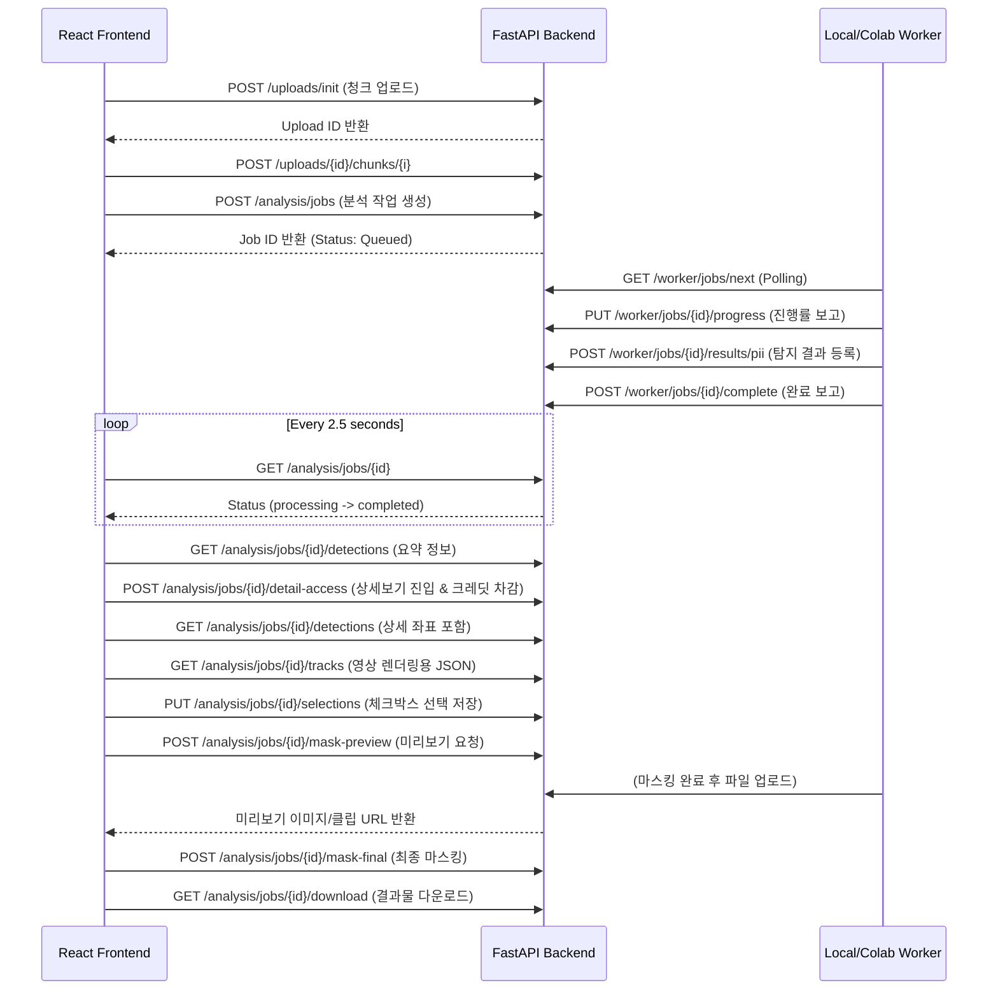

# 프론트엔드 ↔ 백엔드 연결 인터페이스 (Final)

이 문서는 GARIM 프로젝트의 React 프론트엔드와 FastAPI 백엔드가 어떻게 데이터를 주고받으며 연동되어 있는지 명시한 기술 설명서입니다. 
프론트엔드의 화면 단위(Page) 흐름과 백엔드 API, 워커(Worker) 파이프라인 간의 데이터 흐름을 한눈에 파악할 수 있도록 작성되었습니다.

---
아래 다이어그램을 보려면 vscode 확장 프로그램이 필요합니다. 
(https://open-vsx.org/vscode/item?itemName=bierner.markdown-mermaid)

## 1. 프론트엔드 ↔ 백엔드 전체 연결 아키텍처

---

## 2. 페이지 단위 프론트엔드 API 호출 흐름

프론트엔드(`src/pages/garim/`)는 아래와 같은 API 로직 흐름으로 구성되어 있습니다. `src/utils/api.js`의 래퍼(Wrapper) 함수들을 통해 호출됩니다.

### ① Upload (`Upload.jsx`)
- **역할**: 파일을 검증(확장자 체크)하고 서버로 안전하게 업로드.
- **호출 API**:
  - `initUpload()` → `POST /uploads/init`
  - `uploadChunk()` → `POST /uploads/{id}/chunks/{i}`
  - `completeUpload()` → `POST /uploads/{id}/complete`
  - `createAnalysisJob()` → `POST /analysis/jobs`

### ② 진행 상황 대기 (`AnalysisProgress.jsx`)
- **역할**: 백엔드에서 비동기로 도는 분석 워커의 진행 상태를 2.5초 간격으로 확인.
- **호출 API**:
  - `getAnalysisJob(jobId)` → `GET /analysis/jobs/{id}`

### ③ 분석 리포트 (`AnalysisReport.jsx`)
- **역할**: 분석 완료 후, 전체 탐지 건수 및 위험도 게이지 표시. 상세 내역 열람 전 요금제/크레딧 결제 확인.
- **호출 API**:
  - `getJobDetections(jobId)` → `GET /analysis/jobs/{id}/detections` (요약 데이터 렌더링용)
  - `chargeDetailAccess(jobId, fileType)` → `POST /analysis/jobs/{id}/detail-access` (크레딧 차감)

### ④ 마스킹 대상 선택 (`ReplaceOptions.jsx`)
- **역할**: 결제 승인 후 접근. 영상/이미지 위에 개인정보 좌표(Bbox)를 그리고 사용자가 가릴 항목 선택.
- **호출 API**:
  - `getJobDetections(jobId)` → 전체 좌표 리스트 조회
  - `getJobTracks(jobId)` → `GET /analysis/jobs/{id}/tracks` (영상 전용: 1초당 프레임별 좌표 매핑)
  - `saveSelections(jobId, selections)` → `PUT /analysis/jobs/{id}/selections` (체크박스 상태 저장)

### ⑤ 마스킹 미리보기 (`Preview.jsx`)
- **역할**: 사용자가 선택한 부분만 마스킹을 적용해보고, 가림바(ComparisonSlider) 컴포넌트로 전/후 비교.
- **호출 API**:
  - `triggerMaskPreview(jobId, options)` → `POST /analysis/jobs/{id}/mask-preview` (영상인 경우 앞뒤 3초 클립 조건 포함)

### ⑥ 최종 결과 (`ResultPage.jsx`)
- **역할**: 워커에 최종 렌더링 작업을 지시하고, 완료된 파일을 유저에게 제공.
- **호출 API**:
  - `triggerMaskFinal(jobId)` → `POST /analysis/jobs/{id}/mask-final`
  - `getResultFile(jobId)` → `GET /analysis/jobs/{id}/result-file` (파일 메타 및 보관 만료일)
  - `getDownloadUrl(jobId)` → `GET /analysis/jobs/{id}/download` (파일 Binary Response)

---

## 3. 백엔드 ↔ 워커(Worker) 간 연결 통신

로컬(`backend/local_worker/local_worker.py`) 및 외부 GPU 워커는 백엔드의 `/worker/*` 엔드포인트를 통해 통신합니다. **(Bearer Token 인증 필수)**

| 메서드 | 엔드포인트 | 목적 |
|---|---|---|
| `GET` | `/worker/jobs/next` | 큐에 대기 중인 `analysis`, `mask_preview`, `mask_final` 작업 획득 |
| `POST` | `/worker/jobs/{id}/accept` | 작업을 자신이 처리하겠다고 락(Lock) 설정 |
| `PUT` | `/worker/jobs/{id}/progress` | 분석 진행 상태(퍼센트) 및 현재 단계 문자열 갱신 |
| `POST` | `/worker/jobs/{id}/results/pii` | 탐지된 시각 및 음성 PII 리스트를 DB(`detections` 테이블)에 적재 |
| `POST` | `/worker/jobs/{id}/results/artifact` | 렌더링을 돕기 위해 생성된 JSON 좌표 파일 및 상세보기 영상 경로를 DB에 저장 |
| `POST` | `/worker/jobs/{id}/results/upload-file`| 외부 Colab 워커에서 렌더링이 완료된 mp4 바이너리 파일을 백엔드 스토리지로 업로드 |
| `POST` | `/worker/jobs/{id}/complete` | 최종 성공 상태 보고 및 Job 종료 처리 |
