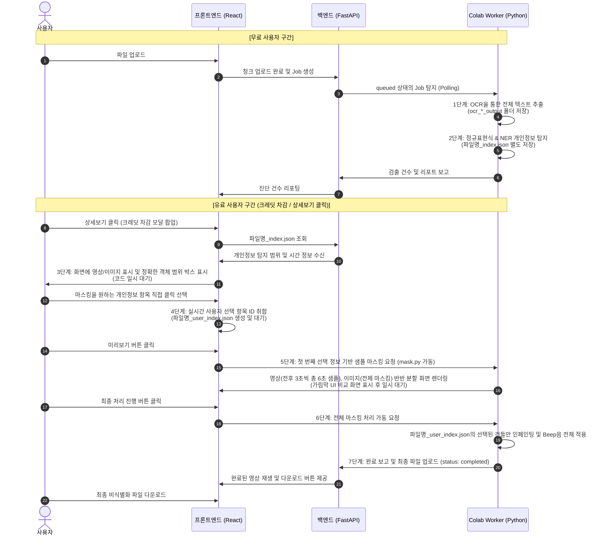

# GARIM 프로젝트 비즈니스 기획 및 기술 아키텍처 총정리 보고서

본 문서는 GARIM(가림) 서비스의 **기획 배경, 타겟 사용자, 핵심 가치**와 더불어, 기획 단계 대비 **현 단계에서 변경 및 구체화된 기술적 마스킹 사양**, 그리고 **1단계부터 7단계에 이르는 상세한 데이터/코드 흐름도**를 종합하여 정리한 최종 요약 문서입니다.

---

## 1. 서비스 기획 배경 및 비즈니스 목적

### 1.1. 기획 배경: '퍼즐 도싱(Doxxing)'의 차단
- 현대의 개인정보 유출은 단순한 DB 해킹뿐만 아니라, 사용자가 SNS나 브이로그에 무심코 노출한 영상 프레임 속 택배 송장, 자동차 번호판, 거리에 비친 주소판, 혹은 통화 소리 등 파편화된 정보들이 모여 한 사람의 신상과 거주지가 특정되는 **'퍼즐 도싱'**을 통해 주로 발생합니다.
- 기존의 수동 편집 툴이나 일괄 모자이크는 영상의 미적 퀄리티(영상미)를 크게 훼손하여 사용자가 보안 처리를 기피하게 만드는 요인이 되었습니다.

### 1.2. 비즈니스 목적 및 타겟 고객
- **메인 타겟 (인플루언서 및 크리에이터)**: 사생활 노출에 가장 민감하고 영상의 미적 가치를 극도로 중요시하는 타겟으로, 원래의 영상미를 100% 보존하면서 자연스럽게 개인정보만 지워주는 솔루션에 기꺼이 비용(구독 및 크레딧)을 지불할 고가치 고객층입니다.
- **서브 타겟 (일반 대중)**: 중고거래 영수증 인증, 일상 SNS 업로드 시 유출을 예방하고자 하는 일반 대중으로, 무료 진단 리포트를 통해 트래픽을 확보하고 점진적으로 유료 기능 사용을 유도합니다.

---

## 2. 변경 및 정립된 기술적 요구사항

최초 기획 시 고려되었던 일부 무겁고 연산량이 큰 AI 모델 적용 방식은, 현재 개발 단계에서의 리소스 최적화와 정확도를 위해 다음과 같이 고도화 및 단순화되었습니다.

1. **YOLOv11, SAM 2, STE(Scene Text Editing) 모델 배제**
   - 불필요한 GPU 서버 부하와 처리 지연을 방지하기 위해 사용하지 않기로 최종 확정하였습니다.
2. **이미지/영상 마스킹 방식 변경 (인페인팅 적용)**
   - 텍스트를 다른 임의의 텍스트 이미지로 합성하는 STE 모델 대신, 텍스트가 탐지된 박스 영역만을 주변 픽셀 정보로 자연스럽게 채워 지우는 **인페인팅(Inpainting)** 기법을 활용하여 시각적 이질감을 없앱니다.
3. **오디오 마스킹 방식 보강 (단어 단위 비프음)**
   - 전체 음성 세그먼트를 통째로 비프음 처리하여 대화가 단절되는 문제를 막기 위해, Whisper의 `word_timestamps=True` 옵션을 적용합니다. 
   - 개체명 인식(NER Roberta-large) 및 정규표현식으로 주소, 전화번호, 이름 등 핵심 단어를 검출하고, 해당 **단어 단위의 정밀한 ms 타임프레임에만 1000Hz Sine Beep음을 오버레이**하여 합성합니다.

---

## 3. 7단계 마스킹 동작 및 제어 흐름 (코드 분할 설계)

동작 흐름은 크게 진단 및 리포트를 수행하는 `colab_pipeline_report.py` (1~2단계 / 무료 구간)와 사용자의 선택에 따라 실제 비식별화를 가동하는 `colab_pipeline_mask.py` (3~7단계 / 유료 구간)로 이원화되어 작동합니다.

### 상세 단계 설명:
1. **1단계 (OCR 텍스트 추출 - report.py)**: 사용자가 업로드한 파일(영상/이미지)에서 OCR로 전체 글자 데이터를 긁어옵니다. 이 데이터는 개인정보 탐지 전의 원본 백업본이며, 영상은 단어 좌표와 재생 시간, 이미지는 구역 및 좌표를 JSON으로 만들어 `ocr_video_output` / `ocr_image_output` 폴더 내에 저장합니다.
2. **2단계 (개인정보 진단 - report.py)**: 전체 글자 중 정규표현식(전화번호, 주소, 이름 등)과 NER 모델을 이용하여 매칭되는 개인정보 목록만 골라내어 `파일명_index.json`으로 따로 저장하고 리포트 화면에 탐지 건수를 표시합니다. (여기까지 무료 범위)
3. **3단계 (상세보기 및 영역 표시 - mask.py 제어 대기)**: 사용자가 상세보기를 누르면 결제/크레딧이 확인된 후 상세 화면이 열립니다. 2단계의 JSON 정보를 바탕으로 개인정보 영역에 정밀하게 외곽 박스를 그어 시각화합니다. (다음 조작 전까지 프로세스는 일시 대기)
4. **4단계 (보안 범위 선택 - mask.py 제어 대기)**: 사용자가 가릴 영역들을 토글식으로 클릭 지정합니다. 프론트엔드는 지정된 ID 정보를 메모리에 담고 있으며, 사용자가 미리보기 버튼을 클릭할 때 최종 확정된 내역을 `파일명_user_index.json`으로 저장합니다. (프로세스 대기)
5. **5단계 (샘플 미리보기 - mask.py 샘플 구동)**: `파일명_user_index.json`에 기록된 타겟 중 가장 첫 번째 정보를 샘플로 마스킹합니다. 원본과 마스킹본을 한 화면에 절반씩 결합하여 배치하고, 슬라이더 형태의 가림막 UI를 드래그하여 두 화면을 비교할 수 있도록 샘플 영상(전후 3초씩 총 6초 분량) 또는 이미지를 임시 생성합니다. (최종 실행 버튼 클릭 전까지 프로세스 대기)
6. **6단계 (전체 마스킹 실행 - mask.py 전체 구동)**: 사용자가 '처리 진행'을 누르면 멈춰있던 코드가 원본 파일을 가져와 `파일명_user_index.json`에 명시된 선택적 개인정보(예: 총 5건 중 선택한 3건)에 대해 전체 인페인팅 및 비프음 합성을 원클릭으로 일괄 처리합니다.
7. **7단계 (다운로드 및 완료)**: 마스킹이 완료된 최종 미디어를 재생하여 확인하고, 로컬 디스크로 내려받을 수 있는 최종 결과물 다운로드 링크를 제공합니다.

---

## 4. 백엔드 및 인프라 아키텍처 (인증 / 결제 / Docker)

### 4.1. 소셜 로그인 및 사용자 상태 관리
- **OAuth-only 구조**: 이메일/비밀번호 로그인을 차단하고 Google, Kakao, Naver 등 검증된 OAuth 제공자만을 통해 회원을 식별합니다.
- **쿠키 및 세션 저장소**: 
  - `access_token` JWT(900초 수명)와 `refresh_token` JWT(7일 수명, `/auth/refresh` 경로 한정)를 **HttpOnly Cookie**에 주입하여 프론트엔드 자바스크립트의 토큰 탈취를 방어합니다.
  - Redis에 `auth:session:{session_id}` 형태로 사용자 정보, IP, User-Agent, JWT의 고유 jti 식별자 및 Hashed refresh token을 실시간 저장하여 매 API 호출 시 교차 검증합니다. 관리자가 유저를 차단(`status = suspended`)하거나 회원이 탈퇴하면 Redis 세션이 즉시 폐기되어 즉각 강제 로그아웃됩니다.
- **안전한 로그인 리다이렉트(Next Parameter 검증)**: 사용자가 탐지 화면(`/upload`)이나 결제 화면(`/payment`) 등 특정 목적지를 갖춘 상태에서 로그인을 시도할 때 `next` 파라미터를 사용합니다. 백엔드에서는 OAuth Callback 성공 시 `safe_frontend_path()` 함수를 통해 악의적인 외부 도메인(예: `//evil.com`)이나 유효하지 않은 경로를 오픈 리다이렉트 취약점으로부터 차단하고 안전한 내부 경로로만 리다이렉트되도록 통제합니다. 관리자 로그인 시에는 일반 `next` 흐름과 무관하게 무조건 관리자 모니터링 페이지(`/admin/monitoring`)로 강제 직행합니다.

### 4.2. 관리자 정책 및 토스페이먼츠 결제 시스템 연동
- **구독(Subscription)과 크레딧(Credit) 스키마의 분리**: 결제 상품은 월단위 '구독 플랜'(`plans`, `subscriptions`)과 1회성 '크레딧 충전'(`credit_plans`, `user_credit_balances`, `credit_ledger`)으로 완벽히 분리되어 관리됩니다. 결제 확인 시 트랜잭션을 통해 구독 활성화 또는 크레딧 지급이 각각의 원장에 독립적으로 안전하게 기록됩니다.
- **토스페이먼츠(Toss Payments) 결제 검증 및 멱등성**:
  - 프론트에서 결제창을 띄우기 전에 반드시 백엔드 임시 주문 API(`POST /payment/temp-order`)를 호출해 금액의 위변조를 막습니다. (주문 ID는 `payment_id` UUID를 매핑)
  - 결제 완료(Confirm) 시 백엔드는 클라이언트가 넘긴 금액과 DB에 사전 생성된 주문 금액이 완벽히 일치하는지 이중 검증(Double-check)합니다.
  - 동일한 결제 승인 요청이 여러 번 들어와도(새로고침, React StrictMode 등), DB의 결제 상태(`status = 'success'`)를 먼저 조회하여 중복 과금을 원천 차단하는 멱등성(Idempotency) 처리가 핵심적으로 구현되어 있습니다.
  - 정책 상 `secret` 키나 결제용 환경변수, `checkout.url`은 데이터베이스에 불필요하게 적재하지 않으며 프론트엔드에도 절대 노출하지 않습니다.
- **결제 및 환불 검증**: 환불 액션은 `audit_logs` 테이블에 행동 기록을 강제하며, 운영자 화면에 Toss의 불필요한 민감 정보가 직접 노출되지 않도록 UI에서 완벽 차단합니다.

### 4.3. Docker 개발 및 운영 환경의 분리
- **개발 환경 (Development)**:
  - 프론트엔드는 빌드 과정 없이 실시간 컴파일과 HMR(Hot Module Replacement)이 가능한 Vite 개발 서버(포트 3000)를 컨테이너로 가동합니다.
  - 백엔드는 Uvicorn의 `--reload` 모드로 볼륨 마운트된 로컬 코드를 실시간 추적합니다.
  - Nginx는 순수 **Reverse Proxy**로 작동하여 `/`는 `final_frontend:3000`으로, `/api`는 `final_backend:8000`으로 토스하고 WebSocket 업그레이드 헤더를 지원합니다.
- **운영 환경 (Production)**:
  - 프론트엔드는 Dockerfile 빌드 단계에서 `npm run build`를 수행해 순수 정적 리소스(`dist`)만 named volume을 통해 Nginx로 직접 전송합니다. 소스 코드의 바인드 마운트는 금지됩니다.
  - Nginx는 named volume에 공유된 `dist` 정적 파일을 직접 최적화하여 서빙하고, `/api` 경로만 백엔드 포트로 포워딩합니다.

---

## 5. 향후 개발 로드맵 및 남은 작업 (Future Roadmap)

본 프로젝트는 현재 활발히 개발이 진행 중인 단계(Intermediate Stage)이며, 향후 프론트엔드 및 백엔드와의 완벽한 파이프라인 통합을 위해 다음과 같은 작업들이 예정되어 있습니다. 

### 5.1. 주요 남은 작업 목록
1. **영상/이미지 마스킹 코드와 STT 연동**: 
   - 현재 Colab 환경에서 동작하는 영상/이미지 객체 마스킹(Inpainting) 코드와 STT 마스킹(Beep) 코드를 결합합니다. GPU VRAM 리소스 효율에 따라 가능할 경우 두 프로세스를 병렬로 연동하여 속도를 단축합니다.
2. **최종 미디어 병합 (FFmpeg 합성)**: 
   - `mask.py` 작업 시, 시각적 마스킹(인페인팅된 영상 프레임)과 STT 기반 오디오 마스킹(비프음이 오버레이된 오디오)이 각각 완료되면, 최종적으로 `FFmpeg`를 이용해 두 미디어를 완전한 하나의 파일로 합성합니다. 이 파일이 사용자에게 미리보기 및 최종 다운로드본으로 제공됩니다.
3. **파이프라인 아키텍처 연결 (Front/Back/Colab)**: 
   - 마스킹 및 STT 파이프라인(Colab Worker)이 완성되면, 최초 진단을 수행하는 `report` 파이프라인과 비식별화 처리를 수행하는 `mask` 파이프라인을 프론트엔드와 백엔드의 어느 엔드포인트에 어떻게 연결해야 구조적으로 가장 효율적인지 파악하고 연결 작업을 수행합니다.
4. **프론트엔드 UI/UX 동시 구현**: 
   - 백엔드와 파이프라인 연결 작업에 맞추어 프론트엔드의 화면(진단 업로드 ➔ 리포트 확인 ➔ 마스킹 범위 선택 ➔ 최종 결과물 재생) 구성 및 뷰 작업을 병행합니다.
5. **E2E 통합 검증 테스트**: 
   - 각 페이지 및 모듈 연결이 완료된 후, 파일 업로드 시점부터 최종 마스킹된 영상 다운로드 시점까지의 전 과정 통합 검증(End-to-End Test)을 수행합니다.

> [!WARNING]
> **개발 진행 중 알림 (Work in Progress)**  
> 현재 Nginx를 포함한 프로덕션 인프라 라우팅 및 일부 연결 모듈이 아직 최종 구현되지 않은 상태입니다. 따라서 상기 기재된 구현 방향, 아키텍처 구조, 병렬 처리 도입 여부 등은 추후 개발 및 연동 테스트 과정에서 효율성 제고를 위해 언제든지 변동되거나 수정될 수 있습니다.
