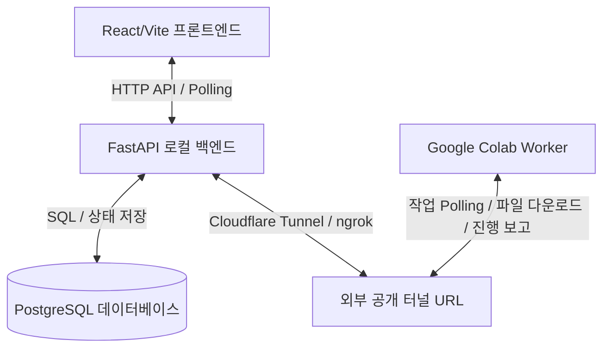

# GARIM 프로젝트 아키텍처 및 흐름 분석 리포트

본 문서는 GARIM 서비스의 백엔드, 프론트엔드, Google Colab Worker, 그리고 데이터베이스(DB) 간의 유기적인 연동 구조와 소스 코드 수준의 흐름을 분석하여 정리한 보고서입니다.

---

## 1. 아키텍처 개요 (Architecture Overview)

GARIM은 영상, 이미지, 음성 파일에서 개인정보(텍스트, 음성 등)를 탐지하고 이를 자동으로 마스킹(비프음 삽입 등) 처리해주는 서비스입니다. 아키텍처는 크게 세 부분으로 구성됩니다:



- **프론트엔드 (React / Vite)**: 사용자가 영상을 업로드하고, 실시간 분석 진행률을 모니터링하며, 분석 결과(리포트 및 비식별화된 영상)를 확인 및 다운로드하는 UI입니다.
- **백엔드 (FastAPI / PostgreSQL)**: 회원 인증, 파일 업로드 세션(청크 단위), 분석 작업(Job)의 상태 저장 및 프론트엔드 조회 API를 담당합니다. 외부 터널링 도구(Cloudflare Tunnel, ngrok)를 통해 외부에 API를 공개합니다.
- **Colab Worker (Whisper / PaddleOCR 등)**: 외부 공개 터널을 통해 백엔 작업을 감시(Polling)하다가, 분석 작업을 가져가서 로컬(Colab GPU 인스턴스)에 영상을 다운로드하고 실제 딥러닝 분석 파이프라인을 구동한 뒤 결과를 백엔드에 저장/완료합니다.

---

## 2. 백엔드 (Backend)

### 2.1. 폴더 구조
```text
backend/
├── controllers/          # API 비즈니스 논리 컨트롤러 (라우터에서 직접 호출)
│   ├── uploads.py        # 청크 업로드 상태 관리 컨트롤러
│   ├── worker.py         # Worker 연동 API(작업 수락, 진행률, 하트비트, 결과 저장) 컨트롤러
│   └── ...
├── core/                 # 로깅 및 공통 설정
├── models/               # SQLAlchemy ORM 모델
├── routes/               # FastAPI 엔드포인트 라우팅 정의
│   ├── uploads.py        # /uploads 관련 라우트 정의
│   ├── worker.py         # /worker 관련 라우트 정의
│   └── ...
├── schemas/              # Pydantic 데이터 검증 스키마
├── services/             # 데이터베이스 쿼리 및 서비스 비즈니스 로직
│   ├── uploads.py        # 파일 병합, 상태 저장 DB 처리
│   ├── worker.py         # Job Polling, 결과 적재, 하트비트 기록 DB 처리
│   └── ...
├── utils/                # DB 세션 및 공통 유틸리티
├── main.py               # FastAPI 웹 서버 구동 진입점 (FastAPI App 객체 & 미들웨어/라우터 등록)
└── requirements.txt      # 가상환경 패키지 종속성 정의
```

### 2.2. 핵심 동작 방식 및 코드
1. **`main.py`**: Uvicorn을 통해 실행되며 CORS 설정과 라우터들(`/posts`, `/uploads`, `/auth`, `/settings`, `/admin`, `/analysis`, `/worker`, `/payment`)을 마운트합니다.
2. **`routes/uploads.py` & `controllers/uploads.py`**: 프론트엔드에서 대용량 파일을 전송할 수 있도록 청크(Chunk) 업로드를 관리합니다.
   - `/init` (POST): 업로드 크기, 파일 이름 등으로 세션을 생성합니다.
   - `/{upload_id}/chunks/{chunk_index}` (POST): 분할된 5MB 크기의 조각 파일을 받아 임시 폴더에 저장합니다.
   - `/{upload_id}/complete` (POST): 전송된 모든 조각 파일을 무결성 검사(해시 확인) 후 하나로 병합합니다.
3. **`routes/worker.py` & `services/worker.py`**: Colab Worker와 연결되는 중요 인터페이스입니다.
   - `/jobs/next` (GET): 대기 상태(`queued`)의 작업을 탐색하여 Worker에게 제공합니다.
   - `/jobs/{job_id}/accept` (POST): 특정 작업을 수락하여 상태를 `processing`으로 전환합니다.
   - `/files/{upload_id}/download` (GET): Worker가 분석하기 위해 원본 병합 파일 바이너리를 다운로드하도록 해줍니다.
   - `/jobs/{job_id}/progress` (PUT): 각 분석 단계(stt, visual_ocr 등)의 상세 진행률을 갱신합니다.
   - `/jobs/{job_id}/results/stt` / `/pii` / `/artifact` (POST): STT 텍스트 결과, 탐지된 개인정보 구간 정보, 마스킹 처리된 최종 결과 영상 파일의 정보를 DB에 적재합니다.

---

## 3. 프론트엔드 (Frontend)

### 3.1. 폴더 구조
```text
frontend/
├── public/               # 정적 파일 에셋
├── src/
│   ├── components/       # 재사용 가능한 컴포넌트
│   ├── css/              # 디자인/스타일 시트 (Vanilla CSS)
│   ├── hooks/            # 커스텀 훅
│   ├── pages/            # 서비스 화면 페이지 구성
│   │   └── garim/        # GARIM 서비스 전용 화면 폴더
│   │       ├── Upload.jsx            # 대용량 청크 파일 업로드 화면
│   │       ├── AnalysisProgress.jsx  # 실시간 분석 진행 단계 및 게이지 모니터링 화면
│   │       ├── AnalysisReport.jsx    # 탐지 내역 및 결과 요약 리포트 화면
│   │       └── ...
│   ├── utils/            # 공통 API 호출 및 유틸 기능
│   │   └── api.js        # Axios/Fetch 기반 백엔드 API 클라이언트 정의
│   ├── App.jsx           # 라우팅 매핑
│   └── main.jsx          # React 엔트리 포인트
└── vite.config.js        # Vite 빌드 설정
```

### 3.2. 핵심 동작 방식 및 코드
1. **`Upload.jsx`**:
   - 사용자가 파일을 선택하면 파일의 크기를 계산하여 5MB(`CHUNK_SIZE = 5 * 1024 * 1024`) 단위의 블록으로 분할합니다.
   - `initUpload()`, `uploadChunk()`, `completeUpload()`를 순서대로 백엔드에 요청하여 병합을 완료합니다.
   - 최종 병합 성공 후 `createAnalysisJob()`을 호출해 분석 작업(Job)을 예약하고, 자동으로 실시간 분석 모니터링 페이지(`AnalysisProgress.jsx`)로 리다이렉트합니다.
2. **`AnalysisProgress.jsx`**:
   - `jobId`를 기준으로 2.5초마다 백엔드의 `/analysis/jobs/{job_id}` API를 폴링(Polling)합니다.
   - 화면에서는 분석 진행 단계를 **업로드 완료 ➔ 대기열 등록 ➔ 시각 탐지 ➔ 음성 탐지 ➔ 리포트 생성 ➔ 완료** 총 6단계의 Stepper로 상태 메시지와 진행 바를 시각화합니다.
   - 진행 중 사용자가 "취소"를 누르면 `/analysis/jobs/{job_id}/cancel` API를 전송하여 작업을 중단할 수 있습니다.

---

## 4. Colab Worker & 분석 파이프라인 (Google Colab / Pipeline)

### 4.1. 폴더 구조
```text
colab/
├── COLAB_WORKER_RUNBOOK.md          # Worker 구동 및 연동 절차 문서
├── garim_colab_worker.py/.ipynb     # Colab 환경에서 무한 루프를 돌며 Job을 백엔드에서 Polling하는 Worker 스크립트
├── garim_pipeline.py/.ipynb         # 딥러닝 모델(Whisper, Ko-DLP-NER 등)을 구동하는 핵심 파이프라인 정의
└── garim_visual_pii_ocr_pipeline.py # 동영상 장면 분할(Scene Detect) 및 PaddleOCR을 통한 이미지 텍스트 탐지 파이프라인
```

### 4.2. 핵심 동작 방식 및 코드
1. **`garim_colab_worker.py` (Worker Loop)**:
   - `run_loop()` 함수가 실행되면 백엔드 `/worker/jobs/next` API로 대기 중인 분석 작업이 있는지 주기적으로 감시합니다.
   - 작업이 잡히면 `accept_job()`으로 수락 보고를 하고 별도 데몬 스레드인 `HeartbeatThread`를 가동하여 30초마다 생존 보고(`/worker/heartbeat`)를 백엔드로 보냅니다.
   - 외부 터널을 통해 원본 파일을 Colab 가상환경으로 로컬 다운로드한 뒤, `garim_pipeline.py`의 `run_pipeline(ctx)`을 트리거합니다.
2. **`garim_pipeline.py` (딥러닝 분석 파이프라인)**:
   - **Analyzer 단위의 확장 가능한 아키텍처**로 설계되어 있어, 백엔드 코드를 변경하지 않고도 파이프라인에 새로운 Analyzer 클래스를 손쉽게 플러그인할 수 있습니다.
   - **`VisualOCRAnalyzer`** (10%~40%): `PaddleOCR`과 장면 분할(Scene Detect) 라이브러리를 통해 동영상의 시각 정보 내에 존재하는 개인정보(차량 번호판, 주민번호, 주소 등)의 프레임별 위치 정보를 추출합니다.
   - **`AudioExtractAnalyzer`** (40%~48%): `ffmpeg` 명령어로 동영상에서 16kHz 모노 오디오(WAV)를 정밀하게 추출합니다.
   - **`STTAnalyzer`** (48%~68%): `faster-whisper` 모델을 사용해 음성을 텍스트로 바꾸고, 정밀한 매칭을 위해 각 단어별 시작/종료 타임스탬프(`word_timestamps`)를 확보합니다.
   - **`PIIDetectAnalyzer`** (68%~78%): 정규식 패턴과 한국어 전용 RoBERTa 기반 개체명 인식(NER) 모델인 `YakuzaNeko/kr-dlp-ner-roberta-large`를 병행 사용하여 개인정보 텍스트를 찾아내고, 타임스탬프와 매칭하여 정확히 비프음 처리가 필요한 음성 구간의 시작/종료 초를 찾아냅니다.
   - **`BeepRenderAnalyzer`** (78%~90%): `pydub` 패키지를 이용해 탐지된 개인정보 음성 시간대에 1000Hz Sine Beep음을 오버레이합니다. 이 수정된 오디오를 `ffmpeg`를 이용하여 다시 원본 영상에 합성하여 최종 MP4 비식별화 산출물을 렌더링합니다.
3. **결과 보고 및 완료**:
   - 파이프라인이 완료되면 분석 결과들을 백엔드 결과 저장 API(STT 내용, PII 검출 건수, 마스킹 처리된 최종 결과 영상 정보)에 전달하고, `complete_job()`을 호출하여 최종적으로 분석 작업을 끝마칩니다.

---

## 5. 데이터베이스 (PostgreSQL Database)

`docker/database/init/0_init_table_v9.sql` 기준의 핵심 테이블 연동 스키마 구조입니다.

- **`users` / `oauth_accounts`**: 카카오/구글 소셜 로그인 기반의 계정 및 상태 정보.
- **`uploads` / `upload_chunks`**: 청크 파일 업로드의 진행 상태와 최종 병합된 원본 영상 정보 저장.
- **`analysis_jobs`**: 분석 상태(`queued`, `processing`, `completed`, `failed` 등), 전체 진행률, 예상 ETA 시간 등을 저장하며, 이 테이블의 레코드를 프론트엔드가 지속적으로 폴링하고 Colab Worker가 대기열로 수신합니다.
- **`detections`**: 시각/음성 개인정보가 발견된 구체적인 내역(시작 초, 종료 초, 신뢰도, 발견 전사/텍스트 등) 기록.
- **`replacement_actions`**: 탐지 항목별 블러, 비프음, 합성 마스킹 등의 유저 설정 처리 방식 테이블.
- **`processed_files`**: 최종 비식별화 처리 및 비프음 합성이 완료된 출력 영상의 저장 위치 및 보관 기간 관리.
- **`job_worker_heartbeats`**: Worker가 보낸 실시간 하트비트 수신 기록용 테이블.
- **`job_stage_logs`**: 각 분석 단계별(visual_ocr, stt, beep_render 등) 디버그 메시지 및 단독 진행률 기록용 로그 테이블.

---

## 6. End-to-End 전체 데이터/작업 흐름

사용자가 파일을 업로드한 시점부터 분석이 완료되기까지의 종합적인 상태 흐름은 아래와 같습니다:

```text
[프론트엔드]                           [백엔드 API]                       [Colab Worker]
     │                                     │                                    │
     ├─ 1. 파일 분할 후 청크 업로드 ───>  [저장 & 병합]                        │
     ├─ 2. 분석 작업(Job) 생성 요청 ───>  [Job 추가 (status: queued)]          │
     │                                     │                                    │
     │                                     │ <── 3. 대기 Job Polling ───────────┤
     │                                     │     (/worker/jobs/next)            │
     │                                     │                                    │
     │                                     │ ── 4. Job 수락 & status: processing ─┤
     │                                     │                                    │
     │                                     │ <── 5. 원본 파일 다운로드 ─────────┤
     │                                     │                                    │
     │                                     │ <── 6. 30초 주기 heartbeat 송신 ───┤
     │                                     │                                    │
     │                                     │ <── 7. 단계별 진행상황(progress) 보고  ┤
     ├─ 8. 2.5초 주기 Job Polling ────────>│                                    │
     │   (진행률 정보 화면 표시)           │                                    │
     │                                     │                                    │
     │                                     │                    [딥러닝 파이프라인 수행]
     │                                     │                       - Visual OCR
     │                                     │                       - 오디오 추출
     │                                     │                       - Whisper STT
     │                                     │                       - 개인정보 NER 탐지
     │                                     │                       - Beep음 합성 및 렌더링
     │                                     │                                    │
     │                                     │ <── 9. 결과물 정보 보고 ───────────┤
     │                                     │    (STT 텍스트 / PII 구간 / 최종 영상)│
     │                                     │                                    │
     │                                     │ ── 10. Job 상태 완료 처리 ─────────┤
     │                                     │     (status: completed)            │
     │                                     │                                    │
     ├─ 11. 완료 감지 후 리포트 이동 ───> [결과 데이터 조회]                    │
     ▼                                     ▼                                    ▼
```

---

## 7. 가장 효율적인 병렬 처리 전략 (Parallel Processing Strategy)

Colab GPU 환경(VRAM 제한)과 분석 파이프라인의 특성 등 여러 변수를 고려했을 때, 처리 속도를 극대화하기 위한 가장 효율적인 병렬 처리 방법은 다음과 같습니다.

### 7.1. 모달 단위의 병렬 처리 (시각 및 음성 파이프라인 분리)
- **독립적 실행**: 동영상 파일의 경우, 영상(프레임) 분석과 음성(STT) 분석은 서로 종속성이 없습니다.
- **적용 방안**: 파이썬의 `concurrent.futures.ThreadPoolExecutor` 또는 `ProcessPoolExecutor`를 활용하여 **시각 파이프라인(Visual OCR/Masking)**과 **음성 파이프라인(STT/NER/Beep)**을 Colab 내에서 **동시(병렬)에 시작**합니다.
- **최적화**: GPU VRAM 한계를 극복하기 위해, Whisper 모델과 PaddleOCR 모델의 VRAM 할당량을 제한하거나(또는 딥러닝 추론 시점만 직렬화하고 I/O 바운드 작업은 병렬화), 메모리 요구량이 적은 작업(예: 정규식, 오디오 렌더링)을 멀티 스레드에 분산시켜 병목을 방지합니다.

### 7.2. 데이터 단위의 청크(Chunk) 병렬화 (Intra-file Parallelism)
- **영상 분할 처리**: 영상 런타임이 긴 경우, 전체를 순차적으로 프레임 추출하지 않고 영상을 **일정 구간 단위(예: 10초)의 청크(Chunk)**로 나눕니다. 분할된 프레임들의 객체 탐지 및 OCR 연산을 `multiprocessing` 모듈을 사용해 병렬로 수행한 뒤 나중에 타임스탬프를 다시 병합합니다.
- **오디오 Batch 처리**: Whisper 모델을 통해 긴 음성을 처리할 경우, 오디오 전체를 넘기는 대신 구간을 나누거나 Whisper의 **자체 Batching 기능(faster-whisper의 VAD 기반 chunk 등)을 적극 활용**하여 GPU 유휴 시간을 최소화하고 STT 속도를 비약적으로 향상시킵니다.

### 7.3. 작업 큐 기반의 수평적 스케일 아웃 (Horizontal Scaling)
- **멀티 Worker 가동**: 백엔드 아키텍처가 `작업 큐(Queue)`와 `Polling` 방식을 채택하고 있으므로, 사용자 요청이 폭주하거나 대량의 파일이 업로드되는 상황에서 백엔드 서버 증설 없이 **Colab 세션(또는 로컬 GPU 머신) 창을 여러 개 추가로 실행**하기만 하면 됩니다.
- **자동 분산**: 각각 고유한 `WORKER_ID`를 가진 다수의 Worker들이 백엔드의 `/worker/jobs/next` API에서 작업을 개별적으로 낚아채듯 가져가므로, 사용자가 체감하는 처리 시간이 크게 단축되며 완벽한 수평 확장이 즉각적으로 이루어집니다.

---

## 8. 토스페이먼츠(Toss Payments) 결제 연동 및 데이터 분리 흐름

결제 흐름은 보안과 데이터 무결성, 그리고 구독/단건 충전의 분리를 핵심으로 설계되었습니다.

### 8.1. 구독과 크레딧 결제의 논리적 분리
- **구독 결제 (`payments.product_type = 'subscription'`)**:
  - 결제 승인 시 `subscriptions` 테이블을 갱신(`status = 'active'`)하고, 이번 결제로 인한 기본 제공 크레딧(`plans.credits`)을 트랜잭션 내에서 즉시 지급합니다.
- **크레딧 충전 결제 (`payments.product_type = 'credit'`)**:
  - `subscriptions` 테이블의 상태는 변경하지 않고 오로지 `user_credit_balances` 잔액을 충전하며 그 변동 이력을 `credit_ledger`에 기록합니다.

### 8.2. 금액 위변조 방지 및 멱등성(Idempotency) 보장
- **1차 검증 (사전 주문/Temp Order)**: 프론트엔드가 토스 결제창을 띄우기 전, 반드시 백엔드(`POST /payment/temp-order`)에 임시 주문을 등록합니다. 서버는 DB의 상품 요금과 클라이언트 요청 요금을 비교 검증한 후, `payments` 테이블에 상태를 `ready`로 삽입합니다 (이때 `payment_id` UUID가 토스 결제의 `orderId`로 사용됨).
- **2차 검증 (승인/Confirm)**: 토스 측 완료 리다이렉트 후, 프론트가 백엔드에 최종 승인을 요청하면 백엔드는 Toss 승인 API를 호출하기 전에 **1차 검증 금액과 다시 일치하는지 이중 검증**을 수행합니다.
- **멱등성(Idempotency)**: 프론트엔드의 새로고침이나 네트워크 지연으로 백엔드 Confirm API가 중복 호출되더라도, 로컬 DB에서 결제 상태(`status = 'success'`)를 가장 먼저 체크하여 **이미 처리된 결제는 Toss API를 찌르지 않고 즉각 성공 반환**함으로써 중복 과금을 완벽히 차단합니다.
- **보안 통제**: Toss의 `secret` 키, 결제용 환경변수(`TOSS_SECRET_KEY`), 또는 `checkout.url` 등 민감한 정보는 데이터베이스에 저장하거나 프론트엔드에 노출시키지 않습니다. (단, 환불 및 CS 조회를 위한 `paymentKey`, `lastTransactionKey`는 DB에만 안전하게 기록)

---

## 9. 안전한 로그인 리다이렉트 (Login Redirect) 정책

소셜 로그인(OAuth) 시 발생할 수 있는 Open Redirect 취약점을 방어하면서 사용자의 진입점과 목적지를 원활하게 유지하기 위한 보안 정책입니다.

### 9.1. `next` 파라미터를 활용한 흐름 통제
- 사용자가 로그인이 필요한 메뉴("업로드", "요금제 구매" 등)에 비로그인 상태로 진입 시, 목적지를 `next` 파라미터로 인코딩하여 로그인 페이지로 이동합니다 (예: `/login?next=/upload`).
- OAuth 콜백 완료 시, 백엔드는 이 목적지로 사용자를 리다이렉트하되, 악의적인 리다이렉트 방지를 위해 `safe_frontend_path()` 함수로 철저히 검증합니다.
- **안전망 검증 로직**: `//evil.com` 과 같은 외부 도메인이나 허용되지 않은 경로가 발견될 시, 해당 `next` 파라미터를 강제 무시하고 서비스 홈(`/`) 경로로 이동시켜 피싱 공격을 예방합니다.
- **관리자(Admin) 권한 강제 직행**: 일반 사용자와 달리 관리자 등급 계정은 `next` 파라미터 값에 상관없이 언제나 관리자 대시보드 화면(`/admin/monitoring`)으로 강제 이동하도록 보안 통제되어 있습니다.

---

## 10. 향후 개발 로드맵 및 남은 작업 (Future Roadmap)

본 프로젝트는 현재 활발히 개발이 진행 중인 단계(Intermediate Stage)이며, 향후 프론트엔드 및 백엔드와의 완벽한 파이프라인 통합을 위해 다음과 같은 작업들이 예정되어 있습니다. 

### 10.1. 주요 남은 작업 목록
1. **영상/이미지 마스킹 코드와 STT 연동**: 
   - 현재 Colab 환경에서 동작하는 영상/이미지 객체 마스킹(Inpainting) 코드와 STT 마스킹(Beep) 코드를 결합합니다. GPU VRAM 리소스 효율에 따라 가능할 경우 두 프로세스를 병렬로 연동하여 속도를 단축합니다.
2. **최종 미디어 병합 (FFmpeg 합성)**: 
   - `mask.py` 작업 시, 시각적 마스킹(인페인팅된 영상 프레임)과 STT 기반 오디오 마스킹(비프음이 오버레이된 오디오)이 각각 완료되면, 최종적으로 `FFmpeg`를 이용해 두 미디어를 완전한 하나의 파일로 합성합니다. 이 파일이 사용자에게 미리보기 및 최종 다운로드본으로 제공됩니다.
3. **파이프라인 아키텍처 연결 (Front/Back/Colab)**: 
   - 마스킹 및 STT 파이프라인(Colab Worker)이 완성되면, 최초 진단을 수행하는 `report` 파이프라인과 비식별화 처리를 수행하는 `mask` 파이프라인을 프론트엔드와 백엔드의 어느 엔드포인트에 어떻게 연결해야 구조적으로 가장 효율적인지 파악하고 연결 작업을 수행합니다.
4. **프론트엔드 UI/UX 동시 구현**: 
   - 백엔드와 파이프라인 연결 작업에 맞추어 프론트엔드의 화면(진단 업로드 ➔ 리포트 확인 ➔ 마스킹 범위 선택 ➔ 최종 결과물 재생) 구성 및 뷰 작업을 병행합니다.
5. **E2E 통합 검증 테스트**: 
   - 각 페이지 및 모듈 연결이 완료된 후, 파일 업로드 시점부터 최종 마스킹된 영상 다운로드 시점까지의 전 과정 통합 검증(End-to-End Test)을 수행합니다.

> [!WARNING]
> **개발 진행 중 알림 (Work in Progress)**  
> 현재 Nginx를 포함한 프로덕션 인프라 라우팅 및 일부 연결 모듈이 아직 최종 구현되지 않은 상태입니다. 따라서 상기 기재된 구현 방향, 아키텍처 구조, 병렬 처리 도입 여부 등은 추후 개발 및 연동 테스트 과정에서 효율성 제고를 위해 언제든지 변동되거나 수정될 수 있습니다.
