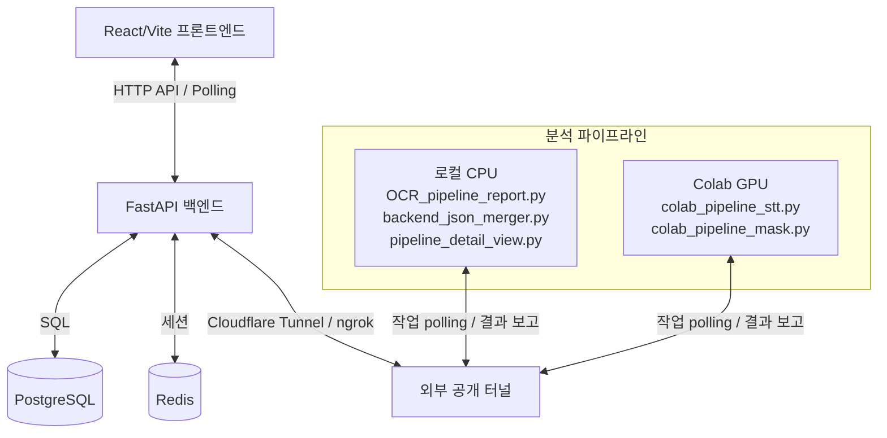

# GARIM 프로젝트 아키텍처 및 흐름 분석 리포트 v2

> **v2 작성 목적**: v1은 "단일 Colab Worker(`garim_pipeline.py`)가 모든 분석을 처리"하는
> 옛 구조 기준이었다. 실제 코드는 **`ocr_mask/` 5분할 파이프라인 + `result.json` 중심**으로
> 재설계됐고, 이제 이 파이프라인을 **이미 만들어진 프론트/백엔드 구조에 끼워 넣어 연동**하는
> 단계다. 본 문서는 ① 현재 코드 실태(✅구현/❌없음/⚠️mock)와 ② **기존 구조에 맞춘 연결 설계**를
> 정리한 연동 기준서다.
>
> **★ 연결 대원칙**: 프론트/백엔드를 우리 코드에 맞추지 않는다. **기존 구조를 최대한 재사용**하고,
> 너무 비효율적이거나 더 나은 방법이 있는 부분만 신규 개발한다.

---

## 1. 아키텍처 개요 (로컬 + Colab 하이브리드)



- **프론트엔드 (React/Vite)**: 업로드 → 진행률 모니터링 → 리포트 → 상세보기 → 선택 → 미리보기 → 처리 → 다운로드.
- **백엔드 (FastAPI/PostgreSQL/Redis)**: 인증, 청크 업로드, 분석 Job 큐/상태, 결과 적재·조회, 결제/구독.
- **분석 파이프라인 (★ v1과 가장 달라진 부분)**: 단일 워커가 아니라 **로컬 CPU 모듈 3종 + Colab GPU 모듈 2종**으로 분할. 시각(OCR)은 로컬, 음성(STT)·마스킹은 Colab에서 수행하며 **시각·음성 탐지는 병렬**로 동시 진행.

---

## 2. 백엔드 현황 (backend/) — 실제 엔드포인트 표

`main.py` 마운트: `/posts /uploads /auth /settings /admin /analysis /worker /payment /subscriptions`

### 2.1 업로드 / 분석 / 워커 (분석 파이프라인 관련)
| 엔드포인트 | 용도 | 상태 |
|-----------|------|------|
| `POST /uploads/init`·`/{id}/chunks/{i}`·`/{id}/complete` | 청크 업로드·병합 | ✅ 구현 |
| `GET /uploads/{id}/status` · `POST /{id}/cancel` | 업로드 상태/취소 | ✅ 구현 |
| `POST /analysis/jobs` | 분석 Job 생성 (+크레딧 1 차감) | ✅ 구현 |
| `GET /analysis/jobs/{job_id}` | Job 상태·진행률·stage_logs 조회 (프론트 폴링) | ✅ 구현 |
| `POST /analysis/jobs/{job_id}/cancel` | Job 취소 | ✅ 구현 |
| `GET /worker/jobs/next` · `POST /{id}/accept` | 워커 큐 polling·수락 | ✅ 구현 |
| `PUT /worker/jobs/{id}/progress` | 단계별 진행률 갱신 | ✅ 구현 |
| `POST /worker/jobs/{id}/results/stt` | STT 결과 → `analysis_artifacts` | ✅ 구현 |
| `POST /worker/jobs/{id}/results/pii` | PII 결과 → `detections` (⚠️ **현재 voice_pii만**) | ⚠️ 부분 |
| `POST /worker/jobs/{id}/results/artifact` | 산출물 파일 → `analysis_artifacts` | ✅ 구현 |
| `POST /worker/jobs/{id}/complete`·`/fail` | 완료/실패 처리 | ✅ 구현 |
| `GET /worker/files/{upload_id}/download` | 원본 파일 다운로드 | ✅ 구현 |
| `POST /worker/heartbeat` | 워커 생존 보고 | ✅ 구현 |

### 2.2 연결 공백 (❌ 아직 없는 엔드포인트)
| 필요 기능 | 상태 |
|-----------|------|
| 리포트/상세보기용 **탐지 목록 조회** (`GET /analysis/jobs/{id}/detections`) | ❌ 없음 |
| 상세보기 **영상/좌표 메타 조회** (`GET /analysis/jobs/{id}/result`) | ❌ 없음 |
| 사용자 **선택 저장** (`PUT /analysis/jobs/{id}/selections`) | ❌ 없음 |
| **미리보기/본처리 마스킹** Job 트리거 | ❌ 없음 |
| **최종 결과물 조회/다운로드** (job 기준) | ❌ 없음 |

> 위 5종은 **3장 매핑 설계**에서 기존 테이블·패턴을 재사용해 메우는 것이 핵심이다.

### 2.3 기존 DB 데이터 계약 (재사용 대상)
- `analysis_jobs`: 상태/진행률/큐/ETA
- `detections`: `detection_type, label, confidence, start_time_sec, end_time_sec, bbox_x/y/w/h, detected_text` — **시각·음성 PII 항목 단위 저장소**
- `analysis_artifacts`: `artifact_type, stored_path, content_type, file_size, metadata` — **파일/대용량 산출물 저장소**
- `replacement_actions`: `is_user_selected, action_type, action_config` — **사용자 선택 저장소**
- `processed_files`: 최종 결과물 + `expires_at` 보관기간

---

## 3. 기존 구조 ↔ 파이프라인 산출물 매핑 ★★최중요

> 원칙: **기존 테이블/엔드포인트를 최대 재사용**, keyframes·polygons 같은 무거운 중첩 데이터만
> 파일(artifact)로 우회해 DB 병목을 피한다.

### 3.1 데이터 매핑표
| 우리 파이프라인 산출물 | 들어갈 기존 위치 | 방식 |
|----------------------|----------------|------|
| `result.json › audio_pii_groups` (음성) | `detections` (`detection_type='voice_pii'`) | ✅ **이미 적재됨** (`save_pii_result`) |
| `result.json › pii_groups` 요약(타입·위험도·시각·bbox) | `detections` (`detection_type='visual_pii'` + `bbox_x/y/w/h`) | 🔧 `save_pii_result()` **확장**(기존 테이블·컬럼 재사용, 새 테이블 X) |
| `result.json` 원본(keyframes·polygons 등 무거운 좌표) | `analysis_artifacts` (`artifact_type='pii_result'`, stored_path) | ✅ `save_artifact()` 재사용 |
| `_상세보기.mp4` | `analysis_artifacts` (`artifact_type='detail_video'`) | ✅ `save_artifact()` 재사용 |
| `_tracks.json` (오버레이 트랙) | `analysis_artifacts` (`artifact_type='detail_tracks'`) | ✅ `save_artifact()` 재사용 |
| 사용자 선택 (프론트 → `is_selected`) | `replacement_actions.is_user_selected` | 🔧 갱신 API 신규(테이블은 재사용) |
| 최종 마스킹본 | `processed_files` + `analysis_artifacts('masked_video')` | ✅ 재사용 |

> **★ 핵심 판단**: 프론트 리스트/필터/마커/선택에 필요한 **가벼운 메타는 `detections`로 조회**,
> 마스킹에 필요한 **무거운 좌표는 `result.json` 파일을 마스킹 워커가 직접 읽음**.
> → DB에 대용량 JSON을 욱여넣지 않아 조회 속도·저장 효율 모두 확보.

### 3.2 연결 시 추가/수정 지점 (재사용 vs 신규)
| # | 작업 | 분류 | 위치 |
|---|------|------|------|
| 1 | `save_pii_result()`에 시각 PII(`visual_pii`) 적재 추가 | 🔧 **기존 함수 확장** | `backend/services/worker.py` |
| 2 | merge 후 `result.json`/`_상세보기.mp4`/`_tracks.json`을 `save_artifact`로 등록 | ✅ 기존 재사용 | worker 결과 보고 단계 |
| 3 | `GET /analysis/jobs/{id}/detections` (목록·필터·마커) | 🆕 **신규**(기존 라우터 패턴 따름) | `routes/controllers/services/analysis.py` |
| 4 | `GET /analysis/jobs/{id}/result` (상세보기 영상 URL + 좌표 메타) | 🆕 신규 | 동일 |
| 5 | `PUT /analysis/jobs/{id}/selections` (선택 저장) | 🆕 신규(테이블 재사용) | 동일 |
| 6 | 마스킹 Job 트리거 (`job_type='mask_preview'`/`'mask_final'`) | ✅ 기존 큐 패턴 재사용 | `analysis.py` + `worker.py` |
| 7 | `GET /analysis/jobs/{id}/result-file` (최종 다운로드) | 🆕 신규(`/worker/files` 패턴) | 동일 |
| 8 | api.js에 위 호출 함수 + 프론트 mock 5페이지 데이터 바인딩 | 🆕 신규 | `frontend/src/utils/api.js`, `pages/garim/*` |

---

## 4. 분석 파이프라인 5모듈 상세 ★중요

| 모듈 | 실행 환경 | 입력 | 출력 | 핵심 |
|------|----------|------|------|------|
| `OCR_pipeline_report.py` | **로컬 CPU** | 원본 영상/이미지 | `{stem}_index.json` | PaddleOCR + 정규식/NER 시각 PII 탐지 |
| `colab_pipeline_stt.py` | **Colab** | 원본 영상 오디오 | `{stem}_stt.json` | faster-whisper(word_timestamps) + NER 음성 PII. **로컬 OCR과 병렬** |
| `backend_json_merger.py` | 로컬 | index.json + stt.json | `{stem}_result.json` | 두 결과 병합 + `timeline_markers` 생성 |
| `pipeline_detail_view.py` | 로컬 CPU | result.json + 원본 | `_상세보기.mp4`, `_tracks.json` | merge **직후 선(先)생성** → 상세보기 클릭 시 지연 0 |
| `colab_pipeline_mask.py` | **Colab GPU** | result.json + 원본 | 최종 마스킹본 | `is_selected=true`만 인페인팅 + 단어단위 Beep |

`result.json` 구조 요약:
- `pii_groups[]` (시각): `pii_id, pii_type, risk_level, is_selected, bbox, polygons, keyframes …`
- `audio_pii_groups[]` (음성): `label, detected_text, start_time_sec, end_time_sec, confidence`
- `timeline_markers[]`: 재생바 마커 (visual/audio, start_sec, left_pct, severity)
- **`is_selected`** (초기 false): 사용자가 선택하면 true → 마스킹 워커가 이 값만 처리

---

## 5. End-to-End 연결 흐름 (3레인) ★중요

```text
[프론트엔드]                    [백엔드 API]                      [파이프라인]
   │                               │                                 │
1. 청크 업로드 ───────────────> /uploads/* (병합)                    │
2. 분석 Job 생성 ─────────────> POST /analysis/jobs (크레딧 차감)     │
   (queued)                       │ <── /worker/jobs/next ───── 로컬 OCR + 코랩 STT
3. 2.5s 폴링 ────────────────> GET /analysis/jobs/{id}              │ (★ 병렬 탐지)
   (진행률/Stepper)               │ <── progress / results/pii(stt) ─┤
   │                              │ <── merger → result.json         │
   │                              │ <── detail_view 선생성(mp4/tracks)│
   │                              │     → save_artifact 등록          │
   │                              │ ── complete(status: completed) ──┤
4. 리포트 조회 ──────────────> GET /analysis/jobs/{id}/detections 🆕  │
   (AnalysisReport 바인딩)        │     (detections + markers)        │
5. 상세보기 ─────────────────> GET /analysis/jobs/{id}/result 🆕      │
   (영상+박스, 선생성물 즉시표시)  │     (detail_video URL + 좌표 메타) │
6. 항목 선택 토글 ───────────> PUT /analysis/jobs/{id}/selections 🆕  │
   │                              │     (replacement_actions 갱신)    │
7. 미리보기(영상=개별6초/이미지=전체)→ mask_preview Job ───────────> 코랩 mask(샘플)
   (가림막 좌우 비교)             │ <── results/artifact(preview) ────┤
8. 처리요청(선택분 전체) ──────> mask_final Job ──────────────────> 코랩 mask(선택분만)
   │                              │ <── processed_files + complete ──┤
9. 다운로드 ─────────────────> GET /analysis/jobs/{id}/result-file 🆕 │
```

---

## 6. 병목 제거 전략 ★중요
1. **시각·음성 탐지 병렬**: 로컬 OCR과 Colab STT 동시 진행 → 전체 분석 시간 단축.
2. **상세보기 선(先)생성**: merge 직후 `_상세보기.mp4`/`_tracks.json`을 미리 만들어 두어,
   사용자가 상세보기 클릭 시 **재생성 대기 없이 즉시** 표시.
3. **선택분만 마스킹**: `is_selected=true` 항목만 처리 → 불필요 연산 제거.
4. **미리보기는 영상 6초 샘플만**: 전체 마스킹 없이 해당 PII 구간(앞 3초~뒤 3초)만 생성.
5. **무거운 좌표는 파일 우회**: keyframes/polygons는 DB 컬럼이 아닌 `result.json` 파일로 →
   조회 API는 가벼운 메타만 반환, 마스킹 워커만 파일 직독.

---

## 7. 프론트엔드 현황 (frontend/src/pages/garim/)

| 페이지 | 라우트 | 상태 |
|--------|--------|------|
| `Upload.jsx` | `/upload` | ✅ 실연동 (청크 업로드 → Job 생성) |
| `AnalysisProgress.jsx` | `/analysis-progress` | ✅ 실연동 (2.5s 폴링 Stepper) |
| `AnalysisReport.jsx` | `/analysis-report` | ⚠️ **정적 mock** (detect-item·marker·SVG 하드코딩, id 없음) |
| `ReplaceOptions.jsx` | `/replace-options` | ⚠️ 정적 mock (선택 UI만, 상태/저장 없음) |
| `Preview.jsx` | `/preview` | ⚠️ 정적 mock (가림막 비교 레이아웃만) |
| `Processing.jsx` | `/processing` | ⚠️ 정적 mock (폴링 없음) |
| `Download.jsx` | `/download` | ⚠️ 정적 mock (다운로드 미구현) |

api.js 보유: `initUpload/uploadChunk/completeUpload/createAnalysisJob/getAnalysisJob/cancelAnalysisJob/getUploadStatus` ✅
api.js 부재(신규 필요): `getDetections / getAnalysisResult / saveSelections / requestMaskPreview / requestMaskFinal / getResultFile`

> mock 미연동의 원인은 "받을 데이터(파이프라인 산출물)가 아직 없어서"였다.
> 파이프라인이 붙고 3장의 조회/선택/마스킹 API가 생기면 mock 페이지에 **데이터 바인딩만
> 얹어 자연스럽게 연동**된다(레이아웃은 이미 완성).

---

## 8. 인프라 요약 (변경 없음 — 압축)
- **인증**: OAuth-only(Google/Kakao/Naver…), Access(900s)+Refresh(7d) JWT를 HttpOnly Cookie,
  Redis `auth:session:{sid}` 교차검증. 401 시 api.js가 `/auth/refresh` 자동 재시도.
- **결제**: Toss. 구독(`plans/subscriptions`)·크레딧(`credit_plans/user_credit_balances/credit_ledger`)
  분리, temp-order 금액검증 + confirm 멱등성. **분석 1건 = 크레딧 1 차감**(`create_analysis_job`).
- **Docker**: dev=Nginx reverse proxy(`/`→Vite:3000, `/api`→backend:8000),
  prod=Nginx가 `dist` 정적 서빙 + `/api` 프록시.

---

## 9. 남은 연결 작업 To-Do
- [ ] (백엔드) `save_pii_result()` 시각 PII 적재 확장 + merge 산출물 artifact 등록
- [ ] (백엔드) detections/result/selections/result-file 조회·저장 API 4종 + 마스킹 Job 트리거
- [ ] (프론트) api.js 함수 6종 추가
- [ ] (프론트) AnalysisReport/ReplaceOptions/Preview/Processing/Download 데이터 바인딩
- [ ] (프론트) AnalysisReport detect-item `id` 부여 + 타임라인 마커 동적화(마커↔카드 연동)
- [ ] (E2E) 업로드→다운로드 전 구간 통합 테스트
