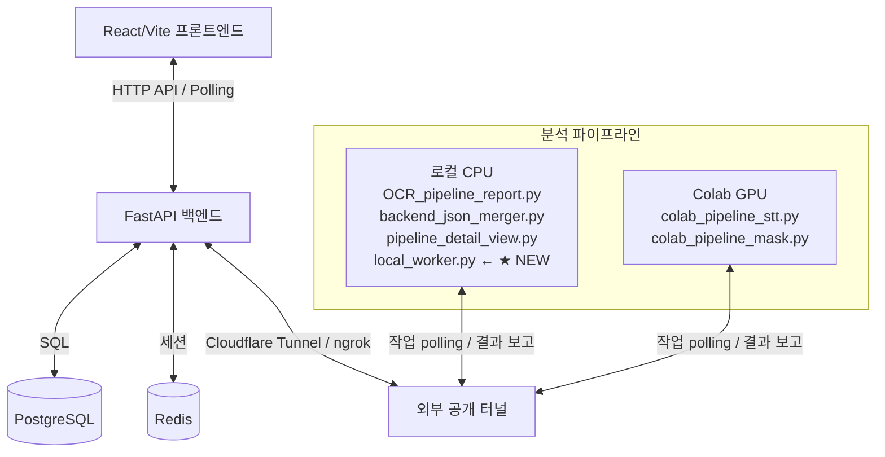

# GARIM 프로젝트 아키텍처 및 흐름 분석 리포트 v3

> **v3 갱신 핵심 (2026-06-14)**:
> - **7페이지 → 6페이지** 확정: Processing+Download → `ResultPage.jsx` 단일 통합
> - **크레딧 정책 변경**: 분석 Job 생성 시 차감 제거 → 상세보기 진입 시 이미지 2 / 영상 3크레딧 차감
> - **Phase 1 완료**: 백엔드 API 6종, 프론트 데이터 바인딩, `local_worker.py` 자동화 구현
> - **Phase 2 개발예정**: `AnalysisReport` 전면 재설계, 이미지 bbox 오버레이, 가림바 슬라이더, `ResultPage` 신규
>
> **★ 연결 대원칙 (유지)**: 프론트/백엔드를 우리 코드에 맞추지 않는다. **기존 구조를 최대한 재사용**하고,
> 너무 비효율적이거나 더 나은 방법이 있는 부분만 신규 개발한다.

---

## 1. 아키텍처 개요 (로컬 + Colab 하이브리드)



- **프론트엔드 (React/Vite)**: ① Upload → ② AnalysisProgress → ③ AnalysisReport → ④ ReplaceOptions → ⑤ Preview → ⑥ ResultPage (6페이지 확정)
- **백엔드 (FastAPI/PostgreSQL/Redis)**: 인증, 청크 업로드, 분석 Job 큐/상태, 결과 적재·조회, 결제/구독.
- **분석 파이프라인**: 단일 워커가 아닌 **로컬 CPU 3모듈 + Colab GPU 2모듈** 5분할. `local_worker.py`가 상시 폴링하여 OCR → 병합 → artifact 등록까지 자동 처리.

---

## 2. 백엔드 현황 (backend/) — 실제 엔드포인트 표

`main.py` 마운트: `/posts /uploads /auth /settings /admin /analysis /worker /payment /subscriptions`

### 2.1 업로드 / 분석 / 워커 (분석 파이프라인 관련)

| 엔드포인트 | 용도 | 상태 |
|-----------|------|------|
| `POST /uploads/init`·`/{id}/chunks/{i}`·`/{id}/complete` | 청크 업로드·병합 | ✅ 구현 |
| `GET /uploads/{id}/status` · `POST /{id}/cancel` | 업로드 상태/취소 | ✅ 구현 |
| `POST /analysis/jobs` | 분석 Job 생성 **(크레딧 차감 없음 ← v3 변경)** | ✅ 구현 (⚠️ 차감 제거 필요) |
| `GET /analysis/jobs/{job_id}` | Job 상태·진행률·stage_logs 조회 | ✅ 구현 |
| `POST /analysis/jobs/{job_id}/cancel` | Job 취소 | ✅ 구현 |
| `GET /analysis/jobs/{id}/detections` | 탐지 목록 조회 (건수·위험도·bbox) | ✅ Phase 1 추가 (260613) |
| `GET /analysis/jobs/{id}/result` | 상세보기 영상 URL + 좌표 메타 | ✅ Phase 1 추가 (260613) |
| `PUT /analysis/jobs/{id}/selections` | 사용자 선택 저장 | ✅ Phase 1 추가 (260613) |
| `POST /analysis/jobs/{id}/mask-preview` | 미리보기 마스킹 Job 트리거 | ✅ Phase 1 추가 (260613) |
| `POST /analysis/jobs/{id}/mask-final` | 본처리 마스킹 Job 트리거 | ✅ Phase 1 추가 (260613) |
| `GET /analysis/jobs/{id}/result-file` | 최종 결과 파일 조회 (만료일 포함) | ✅ Phase 1 추가 (260613) |
| `POST /analysis/jobs/{id}/detail-access` | 상세보기 크레딧 차감 **(신규 ← v3 변경)** | ❌ 개발예정 (크레딧 미차감) |
| `GET /analysis/jobs/{id}/download` | 파일 다운로드 (FileResponse) | ✅ 구현 완료 (260619) |
| `GET /worker/jobs/next` · `POST /{id}/accept` | 워커 큐 polling·수락 | ✅ 구현 |
| `PUT /worker/jobs/{id}/progress` | 단계별 진행률 갱신 | ✅ 구현 |
| `POST /worker/jobs/{id}/results/stt` | STT 결과 → `analysis_artifacts` | ✅ 구현 |
| `POST /worker/jobs/{id}/results/pii` | PII 결과 → `detections` (visual+voice) | ✅ 확장 완료 (260613) |
| `POST /worker/jobs/{id}/results/artifact` | 산출물 파일 → `analysis_artifacts` | ✅ 구현 |
| `POST /worker/jobs/{id}/results/processed-file` | 마스킹 완료 파일 → `processed_files` | ✅ Phase 1 추가 (260614) |
| `POST /worker/jobs/{id}/complete`·`/fail` | 완료/실패 처리 | ✅ 구현 |
| `GET /worker/files/{upload_id}/download` | 원본 파일 다운로드 | ✅ 구현 |
| `POST /worker/heartbeat` | 워커 생존 보고 | ✅ 구현 |
| `POST /worker/jobs/{id}/results/upload-file` | Colab→서버 마스킹 파일 수신 (multipart) | ✅ 구현 완료 (260619) |

### 2.2 기존 DB 데이터 계약 (재사용 대상)
- `analysis_jobs`: 상태/진행률/큐/ETA
- `detections`: `detection_type, label, confidence, start_time_sec, end_time_sec, bbox_x/y/w/h, detected_text, pii_id` — **시각·음성 PII 항목 단위 저장소** (pii_id 컬럼 260614 추가)
- `analysis_artifacts`: `artifact_type, stored_path, content_type, file_size, metadata` — **파일/대용량 산출물 저장소**
- `replacement_actions`: `is_user_selected, action_type, action_config` — **사용자 선택 저장소**
- `processed_files`: 최종 결과물 + `expires_at` 보관기간 (Free=없음, Pro=7일, Studio=14일)

---

## 3. 기존 구조 ↔ 파이프라인 산출물 매핑 ★★최중요

> 원칙: **기존 테이블/엔드포인트를 최대 재사용**, keyframes·polygons 같은 무거운 중첩 데이터만
> 파일(artifact)로 우회해 DB 병목을 피한다.

### 3.1 데이터 매핑표

| 우리 파이프라인 산출물 | 들어갈 기존 위치 | 방식 |
|----------------------|----------------|------|
| `result.json › audio_pii_groups` (음성) | `detections` (`detection_type='voice_pii'`) | ✅ 이미 적재됨 |
| `result.json › pii_groups` 요약 (타입·위험도·bbox) | `detections` (`detection_type='visual_pii'` + `bbox_x/y/w/h` + `pii_id`) | ✅ 확장 완료 (260613) |
| `result.json` 원본 (keyframes·polygons 등) | `analysis_artifacts` (`artifact_type='pii_result'`) | ✅ `save_artifact()` 재사용 |
| `_상세보기.mp4` | `analysis_artifacts` (`artifact_type='detail_video'`) | ✅ `save_artifact()` 재사용 |
| `_tracks.json` (오버레이 트랙) | `analysis_artifacts` (`artifact_type='detail_tracks'`) | ✅ `save_artifact()` 재사용 |
| 사용자 선택 (`is_selected`) | `replacement_actions.is_user_selected` | ✅ 갱신 API 구현 (260613) |
| 최종 마스킹본 | `processed_files` + `analysis_artifacts('masked_video')` | ✅ 등록 API 구현 (260614) |

### 3.2 크레딧 정책 변경 (v2 → v3)

| 항목 | v2 (이전) | v3 (현재) |
|------|-----------|-----------|
| 분석 Job 생성 (`POST /analysis/jobs`) | **1크레딧 차감** | **0크레딧 (차감 없음)** |
| 상세보기 진입 (이미지) | 없음 | **2크레딧** (최초) / **1크레딧** (재진입) |
| 상세보기 진입 (영상) | 없음 | **3크레딧** (최초) / **2크레딧** (재진입) |
| 차감 API | — | `POST /analysis/jobs/{id}/detail-access` 신규 |

---

## 4. 분석 파이프라인 5모듈 상세 ★중요

| 모듈 | 실행 환경 | 입력 | 출력 | 핵심 |
|------|----------|------|------|------|
| `OCR_pipeline_report.py` | **로컬 CPU** | 원본 영상/이미지 | `{stem}_index.json` | PaddleOCR + 정규식/NER 시각 PII 탐지 |
| `colab_pipeline_stt.py` | **Colab** | 원본 영상 오디오 | `{stem}_stt.json` | faster-whisper(word_timestamps) + NER 음성 PII. **로컬 OCR과 병렬** |
| `backend_json_merger.py` | 로컬 | index.json + stt.json | `{stem}_result.json` | 두 결과 병합 + `timeline_markers` 생성 + `pipeline_detail_view.py` 자동 실행 |
| `pipeline_detail_view.py` | 로컬 CPU | result.json + 원본 | `_상세보기.mp4`, `_tracks.json` | merge **직후 선(先)생성** → 상세보기 클릭 시 지연 0 |
| `colab_pipeline_mask.py` | **Colab GPU** | result.json + 원본 | 최종 마스킹본 | `is_selected=true`만 인페인팅 + 단어단위 Beep |

`result.json` 구조 요약:
- `pii_groups[]` (시각): `pii_id, pii_type, risk_level, is_selected, bbox, polygons, keyframes …`
- `audio_pii_groups[]` (음성): `label, detected_text, start_time_sec, end_time_sec, confidence`
- `timeline_markers[]`: 재생바 마커 (visual/audio, start_sec, left_pct, severity)
- **`is_selected`** (초기 false): 사용자가 선택하면 true → 마스킹 워커가 이 값만 처리

### local_worker.py 자동화 흐름 (신규 — 260614)

```
[메인 루프 — 5초 폴링]
GET /worker/jobs/next
  │
  ├─ job_type == 'analysis'
  │    ① POST /worker/jobs/{id}/accept
  │    ② OCR_pipeline_report.run_pipeline(file_path) → index.json
  │    ③ backend_json_merger.merge() → result.json + 상세보기 선생성
  │    ④ POST /worker/jobs/{id}/results/pii      (visual_pii 등록)
  │    ⑤ POST /worker/jobs/{id}/results/artifact (result.json, 상세보기.mp4, tracks.json)
  │    ⑥ POST /worker/jobs/{id}/complete
  │
  └─ job_type == 'mask_preview' | 'mask_final'
       ① POST /worker/jobs/{id}/accept
       ② POST /worker/jobs/{id}/results/processed-file (더미 — 원본 경로 등록)
       ③ POST /worker/jobs/{id}/complete
```

---

## 5. End-to-End 연결 흐름 — 6페이지 기준 ★중요 (v3 전면 갱신)

```text
[프론트엔드]                     [백엔드 API]                       [파이프라인]
   │                                │                                  │
① Upload
1. 청크 업로드 ────────────────> /uploads/* (병합)                     │
2. 분석 Job 생성 ──────────────> POST /analysis/jobs (★크레딧 0)        │
   (queued)                        │ <── /worker/jobs/next ─────── local_worker.py
                                   │         OCR 분석 (+ STT 선택)      │
② AnalysisProgress
3. 2.5s 폴링 ─────────────────> GET /analysis/jobs/{id}               │
   (queued→processing→completed)   │ <── progress / results/pii ──────┤
                                   │ <── merger → result.json          │
                                   │ <── detail_view 선생성            │
                                   │     → save_artifact 등록           │
                                   │ ── complete ──────────────────────┤
③ AnalysisReport (★ 전면 재설계)
4. 건수+위험도만 표시 ──────────> GET /analysis/jobs/{id}/detections    │
   (상세 카테고리 노출 X)           │                                   │
5. "상세보기" 클릭               │                                   │
   → 크레딧 확인 팝업 ────────────> POST /analysis/jobs/{id}/detail-access ❌(개발예정)
   → 이미지 2크레딧 / 영상 3크레딧 차감                                │

④ ReplaceOptions (★ 이미지/영상 완전 분기)
6-이미지. 원본 이미지 + Canvas bbox 오버레이
   체크박스로 마스킹 항목 선택 ──> GET /analysis/jobs/{id}/result       │
   → "미리보기 생성" 클릭         PUT /analysis/jobs/{id}/selections    │
6-영상. 원본 영상 인라인 재생
   + tracks.json Canvas 실시간 오버레이
   → PII별 개별 미리보기 버튼

⑤ Preview (가림바 비교 슬라이더)
7-이미지. mask_preview Job 생성 ─> POST /analysis/jobs/{id}/mask-preview │
   폴링 완료 → 원본/마스킹 가림바  <── local_worker.py (더미) ──────────┤
7-영상. 개별 PII 6초 클립
   두 영상 동기 재생 + clip-path 분할

⑥ ResultPage (★ 신규 — Processing+Download 통합) ✅ 구현 완료 (260619)
8. (이전 페이지에서 생성한) maskJobId 폴링 ─> GET /analysis/jobs/{id} (mask_final) │
   폴링 완료 → 결과 인라인 표시    <── local_worker.py (더미) ──────────┤
   (※ ResultPage 자체는 mask_final 미생성 — ReplaceOptions/Preview "처리진행"에서 생성)
9. 다운로드 ─────────────────────> GET /analysis/jobs/{id}/download ✅(260619)
   만료일 표시 (plans.result_retention_days) ✅
```

---

## 6. 프론트엔드 현황 (frontend/src/pages/garim/) — v3 기준

| 페이지 | 라우트 | v2 상태 | v3 상태 |
|--------|--------|---------|---------|
| `Upload.jsx` | `/upload` | ✅ 실연동 | ✅ (⚠️ 이미지 확장자 유효성 검사 미추가) |
| `AnalysisProgress.jsx` | `/analysis-progress` | ✅ 실연동 | ✅ 유지 |
| `AnalysisReport.jsx` | `/analysis-report` | ⚠️ 실데이터 바인딩 완료 | ❌ **전면 재설계 예정** (건수+위험도만, 크레딧 팝업 추가) |
| `ReplaceOptions.jsx` | `/replace-options` | ⚠️ 실데이터 바인딩 완료 | ❌ **전면 재설계 예정** (이미지/영상 분기, Canvas 오버레이) |
| `Preview.jsx` | `/preview` | ⚠️ 실데이터 바인딩 완료 | ❌ **전면 재설계 예정** (가림바 컴포넌트화) |
| `Processing.jsx` | `/processing` | ⚠️ 실데이터 바인딩 완료 | ⚠️ **ResultPage로 통합됨 (파일 삭제는 미실행)** |
| `Download.jsx` | `/download` | ⚠️ 실데이터 바인딩 완료 | ⚠️ **ResultPage로 통합됨 (파일 삭제는 미실행, pages.js:55 라우트 잔존)** |
| `ResultPage.jsx` | `/result` | ❌ 없음 | ✅ **신규 생성 완료 (260619, Processing+Download 통합)** |

api.js 현황:
- ✅ 기존: `initUpload / uploadChunk / completeUpload / createAnalysisJob / getAnalysisJob / cancelAnalysisJob / getUploadStatus`
- ✅ Phase 1 추가: `getDetections / getAnalysisResult / saveSelections / requestMaskPreview / requestMaskFinal / getResultFile`
- ✅ 260619 추가: `getDownloadUrl` (다운로드 URL 생성 — 문서상 downloadResultFile 역할)
- ❌ 개발예정: `chargeDetailAccess` (크레딧 차감)

신규 컴포넌트:
- ✅ `CreditConfirmModal.jsx` — 크레딧 차감 확인 팝업 (UI만, 실제 차감 API 미연결)
- ✅ `ComparisonSlider.jsx` — 가림바 비교 슬라이더 (이미지/영상 공통, 260617)

---

## 7. 병목 제거 전략 ★중요 (유지)

1. **시각·음성 탐지 병렬**: 로컬 OCR과 Colab STT 동시 진행 → 전체 분석 시간 단축.
2. **상세보기 선(先)생성**: merge 직후 `_상세보기.mp4`/`_tracks.json`을 미리 만들어 두어,
   사용자가 상세보기 클릭 시 **재생성 대기 없이 즉시** 표시.
3. **선택분만 마스킹**: `is_selected=true` 항목만 처리 → 불필요 연산 제거.
4. **미리보기는 영상 6초 샘플만**: 전체 마스킹 없이 해당 PII 구간(앞 3초~뒤 3초)만 생성.
5. **무거운 좌표는 파일 우회**: keyframes/polygons는 DB 컬럼이 아닌 `result.json` 파일로 →
   조회 API는 가벼운 메타만 반환, 마스킹 워커만 파일 직독.

---

## 8. 인프라 요약 (변경 없음 — 압축)

- **인증**: OAuth-only(Google/Kakao/Naver…), Access(900s)+Refresh(7d) JWT를 HttpOnly Cookie,
  Redis `auth:session:{sid}` 교차검증. 401 시 api.js가 `/auth/refresh` 자동 재시도.
- **결제**: Toss. 구독(`plans/subscriptions`)·크레딧(`credit_plans/user_credit_balances/credit_ledger`)
  분리, temp-order 금액검증 + confirm 멱등성. **분석 1건 크레딧 차감 제거, 상세보기 진입 시 차감으로 이동**.
- **Docker**: dev=Nginx reverse proxy(`/`→Vite:3000, `/api`→backend:8000),
  prod=Nginx가 `dist` 정적 서빙 + `/api` 프록시.

---

## 9. ★★★ 개발예정 — Phase 2 (이미지 E2E → 영상 → Colab)

> 아래 모든 항목은 아직 미구현 상태. 진행 순서대로 정리.

### Phase 2-A: 이미지 E2E 완성

| STEP | 파일 | 변경 내용 |
|------|------|----------|
| **A: 크레딧 정책** | `backend/services/analysis.py` | `create_analysis_job()` 내 크레딧 차감 로직 제거 |
| A | `backend/services/analysis.py` | `charge_detail_access(job_id, file_type)` 신규 함수 추가 |
| A | `backend/controllers/analysis.py` | `detail_access_handler()` + `DetailAccessRequest` 모델 추가 |
| A | `backend/routes/analysis.py` | `POST /jobs/{job_id}/detail-access` 라우트 추가 |
| **B: Upload 유효성** | `frontend/src/pages/garim/Upload.jsx` | 이미지 확장자 유효성 검사 추가 (jpg/png/jpeg/webp) |
| **C: 리포트 재설계** | `frontend/src/pages/garim/AnalysisReport.jsx` | 건수+위험도만 표시로 전면 재설계, 크레딧 팝업 연동 |
| C | `frontend/src/components/CreditConfirmModal.jsx` | 신규 생성 (크레딧 차감 확인 팝업) |
| C | `frontend/src/utils/api.js` | `chargeDetailAccess(jobId, fileType)` 함수 추가 |
| **D: 상세 이미지** | `frontend/src/pages/garim/ReplaceOptions.jsx` | 이미지 분기: Canvas bbox 오버레이 + 체크박스 UI 전면 재설계 |
| **E: 가림바** | `frontend/src/components/ComparisonSlider.jsx` | 신규 생성 (이미지/영상 공통 가림바 컴포넌트) |
| E | `frontend/src/pages/garim/Preview.jsx` | 이미지 미리보기 — 가림바 컴포넌트 적용으로 재설계 |
| **F: 결과 페이지** ✅260619 | `backend/services/analysis.py:640` | `download_result_file()` 추가 ✅ |
| F ✅ | `backend/controllers/analysis.py:368` | `download_handler()` 추가 ✅ (문서상 download_result_handler) |
| F ✅ | `backend/routes/analysis.py:22` | `GET /jobs/{job_id}/download` 라우트 추가 ✅ |
| F ✅ | `frontend/src/pages/garim/ResultPage.jsx` | 신규 생성 (Processing+Download 통합) ✅ |
| F ✅ | `frontend/src/utils/api.js` | `getDownloadUrl(jobId)` 추가 ✅ (문서상 downloadResultFile) |
| F ✅ | `frontend/src/data/garim/pages.js:56` | `/result` 경로 추가 ✅ (App.jsx가 map하여 등록) |

### Phase 2-B: 영상 상세 구현

| STEP | 파일 | 변경 내용 |
|------|------|----------|
| **G: 영상 Canvas** | `frontend/src/pages/garim/ReplaceOptions.jsx` | 영상 분기: `<video>` + Canvas 오버레이, timeupdate 이벤트 |
| G | `backend/routes/analysis.py` or static | `tracks.json` 파일 서빙 (artifact_type='detail_tracks' 경로 반환) |
| G | `frontend/src/utils/api.js` | `getTrackData(jobId)` 추가 |
| **H: 영상 미리보기** | `frontend/src/pages/garim/Preview.jsx` | 영상 6초 클립 + 두 `<video>` currentTime 동기화 |
| H | `backend/services/analysis.py` | `create_mask_preview_job()` — `clip_start/clip_end` 파라미터 지원 |

### Phase 3: Colab 실제 마스킹 연결

| STEP | 파일 | 변경 내용 |
|------|------|----------|
| **I: 파일 수신 API** ✅260619 | `backend/services/worker.py:735` | `save_uploaded_processed_file()` 추가 (multipart 파일 저장) ✅ |
| I ✅ | `backend/controllers/worker.py:433` | `upload_processed_file_handler()` 추가 ✅ |
| I ✅ | `backend/routes/worker.py:28` | `POST /jobs/{id}/results/upload-file` 라우트 추가 ✅ |
| **J: Colab 마스크 워커** | `ocr_mask/colab_pipeline_mask.py` | 백엔드 폴링 + ngrok 파일 업로드 로직 추가 |
| J | `ocr_mask/local_worker.py` | 더미 마스킹 → 실제 Colab 위임 분기로 교체 |

### Canvas 오버레이 핵심 구현 코드 (STEP G 참고)

```js
// tracks.json 구조: { frame_N: [{pii_id, bbox:[x1,y1,x2,y2], label}] }
video.addEventListener("timeupdate", () => {
  const fps = 30;
  const frameNo = Math.floor(video.currentTime * fps);
  const boxes = tracks[`frame_${frameNo}`] || [];
  ctx.clearRect(0, 0, canvas.width, canvas.height);
  boxes.forEach(box => {
    ctx.strokeStyle = selected[box.pii_id] ? "red" : "orange";
    ctx.lineWidth = 2;
    const [x1, y1, x2, y2] = box.bbox;
    ctx.strokeRect(x1, y1, x2 - x1, y2 - y1);
    ctx.fillStyle = "red";
    ctx.font = "12px sans-serif";
    ctx.fillText(box.label, x1, y1 - 5);
  });
});
```

### 가림바 영상 동기화 핵심 구현 코드 (STEP H 참고)

```html
<!-- 두 영상 position:absolute 겹침, clip-path로 좌/우 분할 -->
<div class="compare-container" style="position:relative">
  <video id="original" src="{original_url}" />
  <video id="masked" src="{masked_clip_url}"
    style="position:absolute;top:0;left:0;
           clip-path: inset(0 0 0 {sliderPos}%)" />
  <div class="slider" style="left:{sliderPos}%" onMouseDown={startDrag} />
</div>
```

```js
// 두 영상 currentTime 동기화
original.addEventListener("timeupdate", () => {
  if (Math.abs(masked.currentTime - original.currentTime) > 0.05)
    masked.currentTime = original.currentTime;
});
```

---

## 10. 전체 체크리스트

### Phase 2-A (이미지 E2E)
- [ ] STEP A: 크레딧 정책 변경 (서비스/컨트롤러/라우트) — ❌ **크레딧 미차감, 잔여 핵심 과제**
- [x] STEP B: Upload 이미지 확장자 유효성 검사 (260615)
- [x] STEP C: AnalysisReport 전면 재설계 + CreditConfirmModal (260615, 팝업 UI만/차감 미연결)
- [x] STEP D: ReplaceOptions 이미지 SVG bbox 오버레이 (260616)
- [x] STEP E: ComparisonSlider 신규 + Preview 재설계 (260617)
- [x] STEP F: ResultPage 신규 + GET /download API + 라우트 (260619)

### Phase 2-B (영상)
- [ ] STEP G: ReplaceOptions 영상 Canvas tracks.json 오버레이 + tracks.json 서빙
- [x] STEP H: Preview 영상 6초 클립 + 동기 재생 (260617)

### Phase 3 (Colab 연결)
- [x] STEP I: POST /upload-file API (multipart 파일 수신) (260619)
- [ ] STEP J: colab_pipeline_mask.py 폴링 + local_worker.py 더미→실제 교체

### 기타
- [ ] E2E 브라우저 테스트 (Upload → ResultPage 전구간)
- [ ] Processing.jsx / Download.jsx 삭제 (ResultPage 통합 완료 후, pages.js 라우트 잔존)
