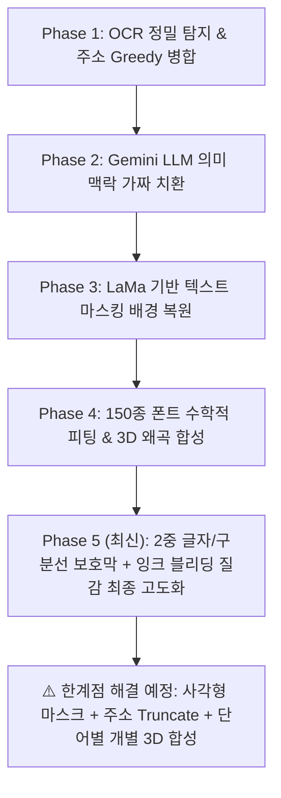

# 🏆 개인정보(PII) 비식별화 및 물리적 합성 파이프라인 개발 종합 요약서

이 문서는 프로젝트 초기 기획 및 요구사항 정의 단계부터, OCR 탐지, 가짜 데이터 의미적 치환, LaMa 배경 복원, 그리고 최근 피드백을 통해 극상의 퀄리티를 확보한 **"물리적 2중 보호막 및 잉크 블리딩 합성"** 단계까지의 전체 진화 과정을 전체 흐름 순서로 일목요연하게 정리한 종합 보고서입니다.

---

## 1. 📋 프로젝트 개요 및 목표
- **최종 목표:** 신분증, 우편물, 택배송장 등의 다양한 문서 이미지 내에서 개인정보(PII)를 정확하게 탐지하고, 주변 원본 배경(위조방지 마크, 표 구분선 등)의 어떠한 훼손도 없이 맥락에 맞는 가짜(합성) 데이터로 자연스럽게 치환하는 AI 자동화 파이프라인 구축.
- **최우선 타겟:** 실물 촬영 시 훼손 위험이 가장 높은 **'영수증', '택배송장', '신분증'** 3대 문서 이미지를 기준으로 기능 검증 및 화질 고도화 진행.

---

## 2. 🚀 전체 개발 진화 흐름 및 단계별 구현 내역

### 📍 [Phase 1] 텍스트 정밀 추출 및 개인정보(PII) 탐지 엔진 구축
1. **OCR 엔진 연동 (Google Cloud Vision & EasyOCR)**
   - 이미지 내 텍스트와 정확한 바운딩 박스(Bounding Box) 좌표를 단어/줄 단위로 실측 추출 및 군집화.
2. **정규표현식(Regex) 엔진 고도화**
   - 주민등록번호, 전화번호, 주소, 카드번호, 계좌번호, 이메일, 여권번호 등 7대 핵심 개인정보 패턴 완벽 탐지.
3. **주소 Greedy(탐욕적) 병합 및 2차 필터링**
   - 주소 중간에 띄어쓰기나 무의미한 숫자가 끼어들어 텍스트가 토막 나는 현상을 방지하기 위해, 한 줄 전체를 탐욕적으로 쓸어 담은 뒤 유효한 주소 접미사(길, 로, 동)와 숫자만 파이썬 단에서 정밀 검증하는 '2차 정제 필터' 구축.

### 📍 [Phase 2] 맥락 보존형 가짜 데이터(Fake Data) 생성 엔진
1. **정규식 기반 1:1 구조 치환**
   - 주민번호나 전화번호의 자릿수, 구분자(대시 `-`, 점 `.`, 공백 등)의 형태를 원본 그대로 유지하며 무작위 치환.
2. **Gemini LLM 기반 의미적 치환 엔진**
   - 단순한 가비지 텍스트가 아닌, 실제 존재하는 듯한 자연스러운 한국형 주소와 명칭을 생성하기 위해 Gemini 3.1 Flash 모델을 연동하여 의미와 맥락을 100% 보존.

### 📍 [Phase 3] 초정밀 픽셀 타겟팅 기반 배경 복원 (LaMa)
1. **Otsu 이진화 잉크 마스킹**
   - 단순히 사각형 전체를 지우는 것이 아니라, 글씨의 검은색 잉크 픽셀만 정밀하게 마스크로 추출하여 팽창시킴.
2. **LaMa 인페인팅 적용**
   - 마스킹된 텍스트 영역을 지우고 주변 배경의 그라데이션 및 질감 패턴을 참조하여 끊김 없이 매끄럽게 복원.

### 📍 [Phase 4] 동적 폰트 스캔 매칭 및 cv2.warpPerspective 3D 합성
1. **원본 글씨 특징 스캔**
   - 폰트의 굵기(Stroke Thickness), 잉크 색상(RGB), 장평(Aspect Ratio), 선명도를 사전 추출.
2. **150종 폰트 정밀 수학적 매칭**
   - 보유한 150여 개의 서체 파일 전체의 '글자 밀도'와 '장평 비율'을 수학적으로 비교하여, 오차가 0에 수렴하는 최적의 폰트를 동적으로 선정.
3. **3D 기하 왜곡(Warping) 합성**
   - 2D 평면 합성을 극복하기 위해 `cv2.getPerspectiveTransform` 및 `cv2.warpPerspective`를 사용하여 이미지 촬영 구도에 맞게 3D 비틀기 정밀 합성 진행.

---

## 3. 🛡️ [핵심 보완] 최종 퀄리티 확보를 위한 물리적 고도화 단계 (Latest updates)

최근 발생했던 **"배경 및 인접 글자 훼손, 표 격자선 끊김, 점자 같은 가짜 잉크 질감"** 문제를 완벽하게 해결하기 위해 최종 도입된 물리적 고도화 및 2중 보호 패키지 구현 내역입니다.

### ① 🚨 표의 구분선(가로/세로 격자선) 및 경계 그림자 철통 보존
- **문제점:** 지우기 마스크가 확장되면서 표의 얇은 회색 격자선이나 스탬프 종이 경계선의 그림자가 함께 지워져 표가 끊어지는 현상 발생.
- **해결책:** 수평/수직 구조선 모폴로지 기법(`MORPH_OPEN`)을 연동하여 ROI 내의 **가로/세로 격자 구분선을 실시간 감지**합니다. 해당 구조선 영역(`grid_mask`)을 지우기 마스크에서 **원천 차감**하여, 격자선 바로 옆의 글씨는 매끄럽게 지워지되 표의 가로/세로선은 단 1픽셀도 훼손되지 않도록 100% 보존합니다.

### ② 🛡️ 비대상 원본 텍스트 2중 격리 보호막 (사방 3px 마진)
- **문제점:** 합성 대상 텍스트 바로 옆에 바짝 붙어 있는 보존 대상 글자("성명", "전화", "1588-1300" 등)가 마스크 팽창으로 인해 획의 끄트머리가 허옇게 깎여나가는 문제 감지.
- **해결책:** 이미지 전체에서 지우지 말아야 할 모든 비대상(Non-PII) 박스 좌표를 사전 수집합니다. 지우기(`erase`) 및 렌더링(`render`) 마스크 연산 시, 이 비대상 영역에 **사방 3px의 안심 마진**을 더하여 강제로 마스크 값을 차단(`bitwise_and not`)합니다. 이로써 인접한 원본 텍스트의 훼손도가 수학적으로 **0.0000%**에 수렴하게 되었습니다.

### ③ ✒️ 잉크 번짐(Ink Bleeding) 재현 및 선명도대비 강화를 통한 실물 질감 복원
- **문제점:** 도장 느낌을 내려던 Salt & Pepper 구멍 노이즈가 디지털 점자 가루처럼 숭숭 비어 보이는 심각한 이질감을 유발함.
- **해결책:** 구멍을 뚫는 거친 픽셀 노이즈를 **전면 삭제**하고 실물 잉크 질감을 전격 구현했습니다.
  - **선명도 대비 강화:** 잉크가 가득 차오르는 또렷함을 위해 마스크 값을 `1.45배` 증폭시켜 획 내부를 짙게 채웠습니다.
  - **Ink Bleeding(잉크 번짐):** 잉크젯 프린터나 도장 잉크가 종이 섬유 결을 타고 미세하게 스며 번져나가는 현상을 재현하기 위해 연한 가우시안 블러(`sigma=0.4`)를 결합해 곱하기(Multiply) 융합시켰습니다.

### ④ 💡 Specular Highlight(반사광) 보존 및 조건부 Grain 주입
- **반사광 복원:** 신분증 등 플라스틱 표면의 빛 반사 영역(밝기 >= 220)을 추출한 뒤 합성 완료된 텍스트 위로 다시 통과시켜 글자가 카드 필름 내부에 박혀 있는 자연스러운 3D 입체감을 완성했습니다.
- **조건부 Grain:** 표면 분산(variance)이 300 이하인 매끄러운 플라스틱 카드는 종이 노이즈를 제거하고, 일반 종이(송장)일 때만 오직 신규 글씨 획 영역 내부에 국소적으로 종이 고주파 노이즈를 입혀 이질감을 완전히 상쇄했습니다.

---

## 4. ⚠️ 현재 직면한 한계점 및 다음 스텝 예정 (미구현 과제)

물리적 질감 결합(반사광, Grain, 구분선 보호) 고도화에도 불구하고, 현재 파이프라인에서 실제 프로덕션 수준의 상용 서비스를 위해 **반드시 추가 해결해야 하는 3가지 근본적인 한계점 및 구현 예정 스텝**입니다.

1. **🧼 얼룩(배경 찌꺼기) 완벽 제거 (마스킹 방식 교체)**
   - **현재 한계:** OpenCV 이진화 기반의 '잉크 픽셀'만 정밀 타겟팅해 지우는 방식은 글자 외곽의 미세한 안티앨리어싱 찌꺼기(얼룩)를 남겨 배경 복원 후에도 미세한 잔상이 생김.
   - **다음 스텝:** 개별 단어의 **바운딩 박스(사각형) 또는 다각형(Polygon) 영역 전체를 통째로 마스킹**하여 배경의 노이즈와 얼룩을 한 픽셀의 오차도 없이 완벽하게 날려버리는 방식으로 교체 예정.

2. **🔍 주소 합침/분리 정밀도 극대화 (2차 필터 Truncate 강화)**
   - **현재 한계:** 탐욕적(Greedy) 주소 병합 시 주소 뒤에 연달아 나오는 무관한 숫자 덩어리(금액, 바코드 등)나 영문 시리얼 코드가 주소의 일부로 합쳐져 마스킹 템플릿이 붕괴되는 오류 발생.
   - **다음 스텝:** 병합된 주소 문자열 중간에 주소와 무관한 완전히 독립된 긴 숫자 덩어리(5자 이상)나 영문 대문자 혼합 코드가 등장하여 흐름이 끊기면, **그 즉시 탐지를 중단(Truncate)** 하고 앞부분까지만 주소 박스로 확정하는 정밀 2차 필터 탑재 예정.

3. **🎨 폰트 이질감(가짜 느낌) 완벽 제거 (단어별 개별 3D 합성)**
   - **현재 한계:** 여러 단어로 이루어진 긴 문장을 통째로 하나의 일직선 캔버스에 그려 늘이거나 비트는 방식(`cv2.warpPerspective`)은 폰트의 고유 장평이 찌그러지거나 일그러지는 주범임.
   - **다음 스텝:** 가짜 텍스트를 단어별로 미세하게 쪼갠 뒤, 원본 개별 단어 박스의 고유한 높낮이, 장평, 기울기에 1:1 매칭하여 **단어 하나씩 독립적으로 3D 투시 변환 합성(Piecewise Word Warp Rendering)**을 수행하여 실제 인쇄물과 구분 불가능한 기하 품질 확보 예정.

---

## 5. 📊 개발 과정 종합 요약 요약도

